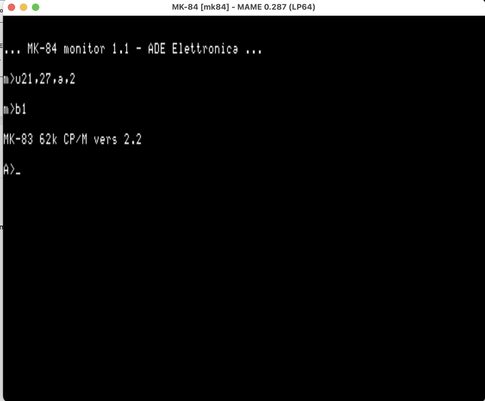

# ADE Elettronica MK3000 / MK83

Preservation and MAME-emulation tree for the **MK3000**, a 1983 multi-format
disk-gateway system by **ADE Elettronica** (Palazzolo Milanese, Italy), built
around the **MK83** Z80A board — a Ferguson Big Board I derivative (Xerox 820
family) that is *not* software-compatible with it (monitor relocates to F800,
not F000; 256K banked RAM; runtime-reconfigurable drive geometry, the heart of
its multi-format mission: reading foreign-format floppies for IBM 370 ingest,
used e.g. at CNR-CUCE Pisa).

All hardware documentation, schematics, the BIOS disassembly listing and the
photographs were provided by **Enrico (vintagesbc.it)** — the maintainer of
the MK3000 — to whom this preservation effort owes its existence. See
`mk3000-correspondence-and-site.md`.

## Layout

| Item | Contents |
|---|---|
| `docs/` | Hardware description, schematics PDF, user manual, CP/M usage, disk-format tables, BSTAM listings, period advertising, the **full BIOS Z80 disassembly listing**, BIOS command/entry-point notes, board photos (Italian) |
| `schematics/` | The six MK3000 schematic sheets (scans) + original archive |
| `roms/` | The dumped MK83 EPROMs (2732 monitor, 2716), as in the MAME `mk83` set |
| `boot-disk/` | Reserved: the reconstructed bootable CP/M disk (in progress — no original MK3000 media is known to survive; the disk is being rebuilt from the BIOS listing and the disk-format tables, by the same byte-provenance method as the Xerox-820-16-8 boot disk) |
| `INDEX.md`, `MK83-MEMORY.md` | Document index and the living bring-up notes for the MAME `mk83` driver |

## Family comparison

`docs/Ferguson-MK-Comparazione-board.numbers` (with a JPEG preview) is
Enrico's systematic comparison of the whole family -- Ferguson Big
Board, MK82, the SCOMAR and CNR MK83s, and the MK84 (5 MHz, 256K,
2x2732A, hardware bank switching) -- covering clocks, EPROM sets,
video RAM, FDC, the per-machine F8xx monitor jump tables, interrupt
vector tables, and console variables.

## MK84

`mk84/` holds Enrico's documentation for the family's next generation,
the MK84 (Z80A at 5 MHz, 256K with hardware bank switching, 2x2732A,
FD1797+9229): hardware operational description, two schematic sets
(with and without the PSU), the system monitor user manual (original
scan and page-reconstructed editions), and a board photograph.  `mk84/roms/` has the system monitor
EPROM ("MK-84 monitor 1.1 - ADE Elettronica", 4K, CRC e49f3c1b) in
three concurring dumps (two of Enrico's plus Ferruccio's).  Media is
still wanted; with ROMs, schematics, manuals, and the family
comparison table, a MAME driver is now within reach.

## MAME status

**Working.** The `mk83` driver was rewritten from these materials (monitor
relocation to F800, 256K banked RAM, FD1797+FDC9229, memory-mapped video,
console select) and the machine boots the reconstructed CP/M 2.2 disk in
`boot-disk/` to an interactive A> (geometry `U21,27,A,2`, then `B1`).
Submitted upstream as mamedev/mame PR #15489, maker attribution corrected
to ADE Elettronica.

Firmware copyright ADE Elettronica; preserved for emulation and historical
reference.

## MK-84 (added 2026-06-12)

The MK-84 (1984), ADE's successor to the MK-83, now runs in MAME
(`mame mk84`): same 256K paged memory and FD1797/FDC9229 disk system,
with the CPU at 5 MHz and the FDC handshake moved to the Xerox-style
HALT-gated NMI.  Firmware is ADE's "MK-84 monitor 1.1" (three
independent dumps in `mk84/roms/` agree).  At the blank power-on
screen press RETURN (console select), then `U21,27,A,2` and `B1`
boots the reconstructed MK-83 CP/M 2.2 disk, unmodified, to `A>`.
The character generator is borrowed from the MK-83 pending a dump
from an MK-84 board; original MK-84 media is wanted.
