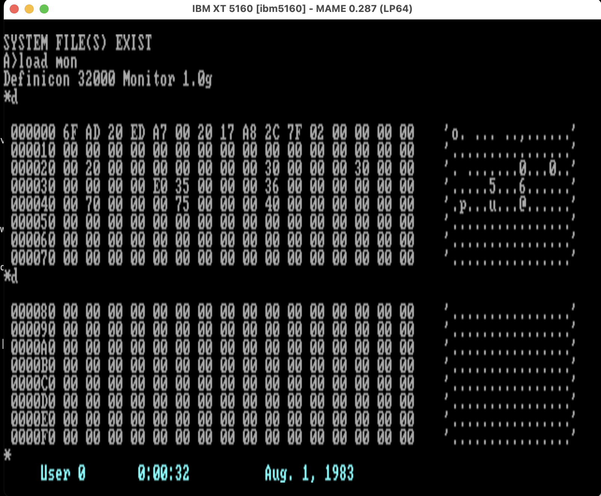

# Definicon DSI-32 Coprocessor Board (1985)



*The Definicon 32000 Monitor on the emulated card (CP/M-86 1.1 host),
dumping 32032 memory: the 12-byte bootstrap the loader wrote is at
address zero, followed by the module tables.*

The DSI-32 is a full-length ISA card for the IBM PC carrying a National
Semiconductor NS32032 32-bit CPU (6 or 10 MHz), NS32081 FPU, optional
NS32082 MMU, and 256 KB to 1 MB of DRAM. It turned a PC into the chassis
for a genuine 32-bit minicomputer-class machine: the August 1985 BYTE
benchmarks place the 10 MHz board between a VAX-11/750 and a VAX-11/780.

Designed and shipped by Definicon Systems Inc. (Chatsworth, later
Calabasas, California). Documented in a two-part BYTE series
(August/September 1985) by Trevor G. Marshall, George Scolaro,
David L. Rand, Tom King, and Vincent P. Williams.

## Architecture

The board carries **no firmware**. An uninitialized CPU is held spinning
by the DIAG vector PAL until the host-side loader takes over. The host
sees a 64 KB memory window (segment E000h, jumper-alternate D000h) into
the 32032's address space, paged by an 8-bit latch (port 160h/2B0h), and
a 4-bit control port (150h/2A0h: DIAG, interrupt-to-32k, reset, refresh
inhibit).

Two cooperating programs make the system:

- **LOAD.EXE / LOAD.CMD** (8088 side; MS-DOS, PC-DOS, or Concurrent
  CP/M) loads the bootstrap, the kernel, and the user program through
  the window, releases the 32032 from reset, then serves as the I/O
  processor for the life of the run.
- **32IO** (32032 side) is the I/O kernel at address 3000h, fielding
  supervisor calls (`SVC`) from user programs and forwarding file,
  console, and port I/O to the host through a mailbox page at 2000h
  (service request words, disk service request block, I/O queues).

The on-board SCN2681 DUART provides two RS-232 ports; its output-port
bit OP5 drives the PC's IRQ2 for 32032-to-host interrupts.

## What is here

- `docs/manual/` — the Definicon DSI-32 manual (chapters 0-8) and
  runtime documentation, from the original distribution.
- `docs/interface.txt` — the prose specification of the supervisor-call
  interface (the UNIX-like MS-DOS interface).
- `docs/byte-articles/` — the two BYTE articles (August 1985 hardware,
  September 1985 software).
- `software/` — `LOAD.EXE`, `32IO.E32`, and `MON.E32` (the Definicon
  32000 Monitor 1.0i) unpacked from the 1984-07-23 production
  distribution, ready for use.
- `software/archive-1987-02-13/` — Dave's final-week working-state
  archive: Loader 2.24v, the mature 32IO and monitors, the complete
  self-hosted toolchain (CC/AS/LN/LIB running on the card), CLIB, and
  the period source archives for all of it. The latest known
  generation of the Definicon software.
- `software/dist-1984/` — the shipped distribution archives (loader
  versions 1.18/1.19, July 1985; the zip file dates say 1984 from a
  bad clock): DOS and Concurrent CP/M loader kits, the Green Hills C,
  FORTRAN, and Pascal compiler distributions, pre-release versions,
  the loader work sources (including the 2.00 beta), floating-point
  work, and benchmarks.
- `source/loader/` — the host-side loader sources (LOAD.C, 32K.ASM,
  IOPROC.ASM, 32KDEF.H, 32KH.INC, MCDOS.EQU; October 1984). These are
  the authoritative reference for the host hardware interface.
- `source/32io/` — the 32000-side kernel source (`32io.a32`) and
  assembler listing (`32IO.L32`).
- `emulator/2017/` — the standalone Series 32000 emulator (Dave Rand,
  2016-2017), which runs the complete DSI-32 toolchain on a modern
  host: `emu cc`, `emu as`, `emu ln`, `emu mon`, and compiled programs.
  CPU core derived from the B-em/PiTubeDirect 32016 emulation
  (Tom Walker, Simon R. Ellwood).
- `emulator/v10a-alec/` — the version 10a continuation (alec@sensi.org,
  August 2017): lowercase filename translation, documented service
  cases, additional options.
- `boot-disks/` — ready-to-run host boot disks, verified in MAME:
  CP/M-86 1.1 + LOAD.CMD + Monitor 1.0g; PC-DOS 2.10 + LOAD.EXE +
  Monitor 1.0i; and a FAT toolchain data disk (assembler, linker,
  opcode table). See `boot-disks/README.md` for formats and recipes.
- `mame-bringup/` — the MAME bring-up harness: `load32.py` builds a
  32032 RAM image from `.e32` files exactly as LOAD.C does; 
  `dsi32_serve.lua` drives the MAME `dsi32` ISA card through the real
  loader sequence and services the mailbox, standing in for LOAD.EXE
  until DOS-hosted operation is set up.

## MAME status

A new ISA8 card device (`-isa5 dsi32`, in `bus/isa/dsi32.cpp`) models
the board: NS32032 + NS32081 + NS32082, 2 MB RAM, SCN2681 at both its
decodings (200100h and F7FE00h), the window/page/control host
interface, and the DUART-OP5-to-IRQ2 interrupt path. First verified
2026-06-10 on `ibm5160`: the shipped 1984 `32IO.E32` + `MON.E32`
binaries boot through the real loader sequence and the monitor signs
on through the mailbox —

```
Definicon 32000 Monitor 1.0i
*
```

Verified 2026-06-11 with the unmodified production loaders on both
operating systems: PC-DOS 2.10 + LOAD.EXE and CP/M-86 1.1 + LOAD.CMD
each boot the card to the Definicon monitor; MON disassembles live
32IO memory over the mailbox. Quick start:

```
mame ibm5160 -bios rev4 -isa4 "" -isa5 dsi32 -flop1 boot-disks/dsi32-cpm86-boot.img
A>load mon
```

Upstream submission pending final review.

## Provenance

All software and documentation from the personal archives of
David L. Rand, who wrote the loader and I/O system as a Definicon
engineer and is on the byline of both BYTE articles. The distribution
archives are the production-shipped binaries (file dates 1984-07-23);
the loader and kernel sources are the working sources (October 1984).
Definicon software is copyright Definicon Systems Inc.; BYTE articles
copyright McGraw-Hill; preserved here for historical reference and
emulation.
