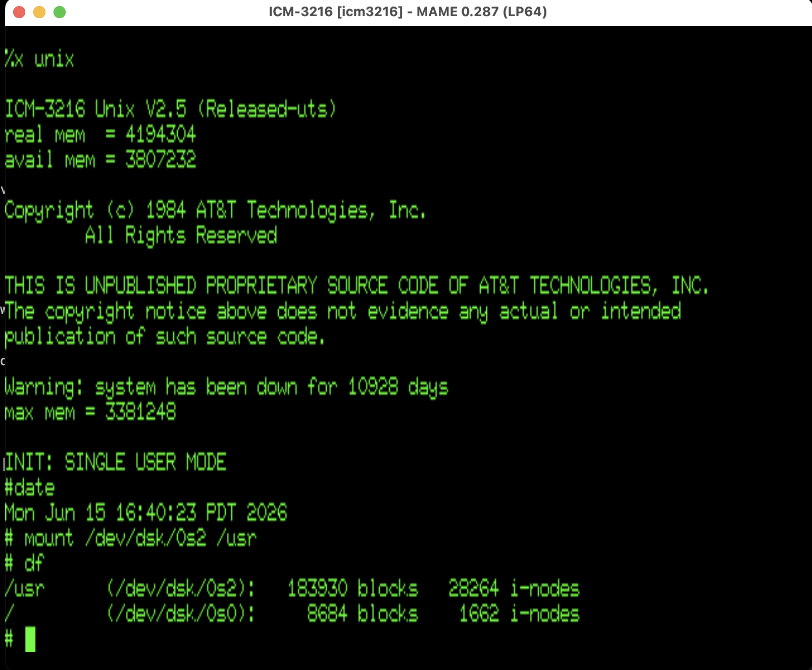

# ICM-3216 — UNIX System V hard-disk image



A complete, bootable UNIX System V (UTS) hard-disk image for the National
Semiconductor **ICM-3216** Integrated Computer Module (NS32016 + Z80 I/O
processor + NCR5385 SCSI), runnable under MAME's `icm3216` driver.

## Provenance

The image was produced by installing the original National Semiconductor
distribution tape onto a SCSI disk: the bootable root filesystem plus both
`cpio` software partitions (the `/usr` tree). Distribution media label:

- **National Semiconductor Corporation**
- **ICM-3216 Unix Binary Software**
- Part number **445600111-001 Rev. B**
- **Feb. 24, 1986**

The original distribution tape is preserved on Bitsavers:

- **<https://bitsavers.org/bits/NationalSemiconductor/NS32000/Genix/icm-unix.7z>**
- related NS32000 / Genix material:
  <https://bitsavers.org/bits/NationalSemiconductor/NS32000/Genix/>

## Layout

```
boot-disks/icm3216_disk.zip   the installed UNIX hard-disk image (CHD), zipped
roms/icm3216.zip              the ICM-3216 ROM set (monitor V2.44 + V1.283, Z80 IOP)
docs/z80-iop.md               the Z80 I/O processor + MiniBus SCSI bridge
icm3216-unix-boot.png         the hero screenshot above
```

`roms/icm3216.zip` is a standard MAME romset (place it in your `rompath`).

`boot-disks/icm3216_disk.zip` contains `icm3216_disk.chd`, a SCSI hard-disk
image holding a full, installed UNIX System V:

- root filesystem, bootable (`x unix`)
- `/usr` on `/dev/dsk/0s2`, populated from both `cpio` software partitions

```
SHA-256 (icm3216_disk.zip) = 327ce9b65469db8160ced47a3d7a49496f3153a91ff5cc450ed53a4096c7ce56
SHA-256 (icm3216_disk.chd) = 4a1558f7cd3dc74037240257e47873a1b17a2147f4dce8f9a0dd2aee60d0e03f
```

## Running

Unzip the disk image first:

```
unzip boot-disks/icm3216_disk.zip
```

Then start the machine. The driver emulates the SCSI I/O processor two ways,
chosen by the **"I/O Processor"** machine-configuration setting:

**Simulated I/O processor (HLE — the default, and faster):**

```
mame icm3216 -hard icm3216_disk.chd
```

**Emulated Z80 I/O processor (LLE — the faithful hardware model):** set
*Machine Configuration → I/O Processor → Emulated Z80 (LLE)*, then attach the
disk on the SCSI bus:

```
mame icm3216 -scsi:1 harddisk -hard1 icm3216_disk.chd
```

> **ROM monitor:** the machine defaults to the **V1.283** monitor, which is the
> one that boots this UNIX image. The other monitor, **V2.44** (`-bios v244`),
> does **not** boot it — leave the default in place.

At the ROM monitor `%` prompt, boot UNIX with:

```
B
```

(equivalent to `x unix`). The system boots to single user; both I/O-processor
paths produce the same result.

## How the I/O works

Disk and tape I/O on the ICM-3216 is offloaded to a Z80 I/O processor running
its own firmware, which owns the NCR5385 SCSI controller and bridges NS32016
main memory across the MiniBus. The protocol — the host mailbox, the command
and `iocb` structures, and the U44/U59/U76 MiniBus address-latch scheme — is
documented in [`docs/z80-iop.md`](docs/z80-iop.md).
