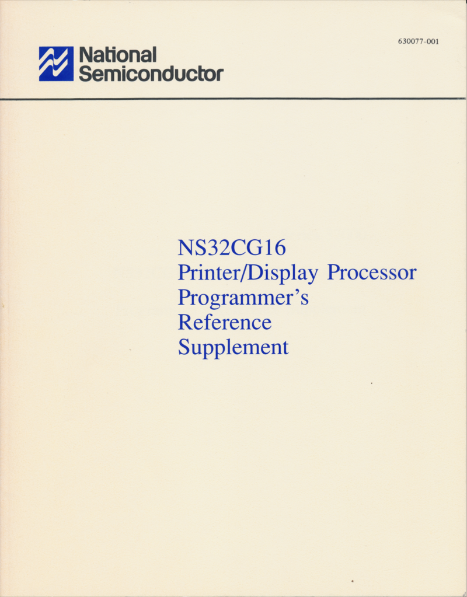
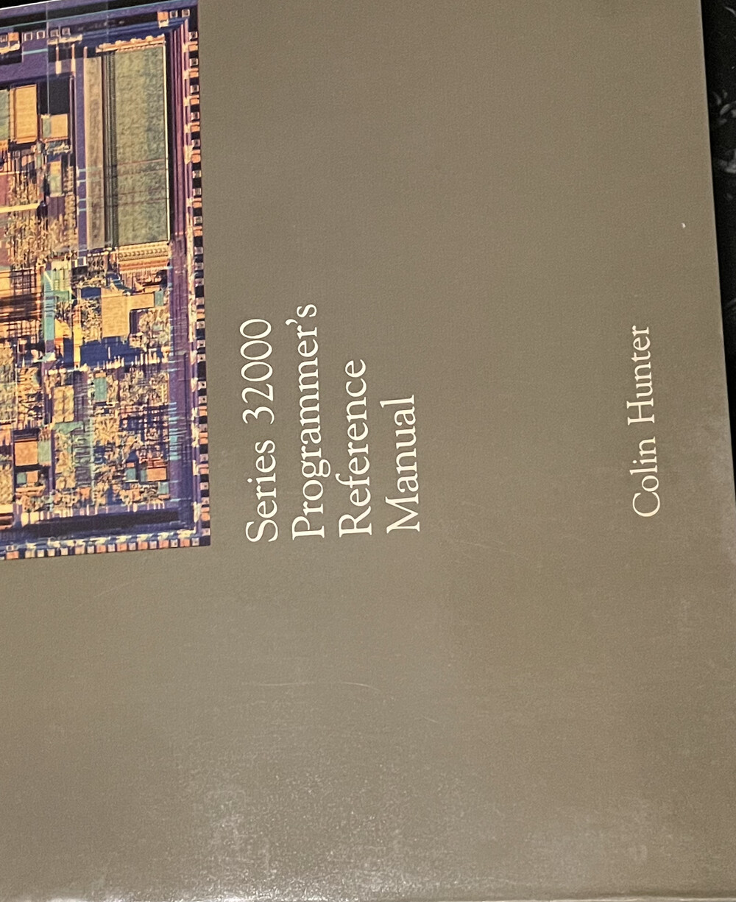

# NS32CG16 Printer/Display Processor

The NS32CG16 is the graphics/printer variant of National Semiconductor's
Series 32000 — an NS32016 core plus a set of bit-aligned graphics
instructions (BitBlt, bit-string set/test, pattern fill, and an external
BitBlt that drives a DP8510/DP8511 BPU) aimed at laser-printer and display
work. It was developed by NSC's Electronic Imaging Group in the late 1980s.

This folder is a **preservation collection** for the NS32CG16: the
Programmer's Reference Supplement, the published application notes, and the
contemporary emulation software and assembly-language library. The point is to
keep this material — much of it long out of print — together and readable
alongside the NS32CG16 support in MAME's `ns32000` CPU core. The application
notes, manual, and library were the references used for that emulation work.

Where an item is reproduced from the original development team's working files
(the WordStar `.ws` drafts and the emulation library), it is provided in its
original form plus a fresh conversion. Original dates below are the dates of the
source documents and files themselves.

## The manual

The *NS32CG16 Printer/Display Processor Programmer's Reference Supplement* —
NSC reference **630077-001** (publication **424511080-001**), Revision 1.55,
**1988-03-11** — documents the NS32CG16-specific graphics instructions and
their encodings. It is a 600-dpi scan of the printed book, deskewed, with a
searchable OCR text layer (PDF/A-2b). No other public copy is known.

The scan is ~200 MB, so it is hosted on the Internet Archive rather than in this
repository:

- **Internet Archive item:** <https://archive.org/details/ns32cg16-printer-display-processor>
- **Direct PDF:** <https://archive.org/download/ns32cg16-printer-display-processor/NS32CG16_Programmers_Reference_Supplement_630077-001_pub-424511080-001.pdf>

The same scan has also been contributed to bitsavers. The entire collection in
this folder is additionally mirrored in the Internet Archive item linked above.

## The datasheet

The **NS32CG16-10** device datasheet (82 pp) — the device-level reference for
the part itself: pin-out, bus and timing characteristics, electrical
specifications, and the graphics-instruction summary. It is the datasheet the
application notes below refer back to.

- [NS32CG16-10_Datasheet.pdf](NS32CG16-10_Datasheet.pdf)

This copy is an aggregator scan (sourced via DigChip.com), included here for
completeness; it can be replaced if a cleaner bitsavers-grade scan surfaces.

The companion **DP8510 BitBlt Processing Unit (BPU)** datasheet — the external
BPU that the NS32CG16's BitBlt instruction drives (see the overview above) — is
included alongside it:

- [DP8510.PDF](DP8510.PDF)

## Series 32000 Programmer's Reference Manual (Hunter)

Colin B. Hunter's **_Series 32000 Programmer's Reference Manual_** (Prentice-Hall,
1987, ISBN 0-13-806936-0) — the architecture-level reference for the whole
Series 32000 family: the programming model, addressing modes, the full
instruction set, and the design rationale behind the architecture.

A commercially published book (still in copyright), so it is **not redistributed
here** — listed as the definitive architecture-level reference for the family.

> One of the best sources of knowledge on programming the 32000 series. Highly
> recommended, I used it extensively over the years. — Dave Rand

## Application notes (`app-notes/`)

National's NS32CG16 application-note series. Each is the published PDF; for the
three notes whose original WordStar drafts survive, the draft (`.ws`) is
included next to the PDF, with fresh `.html`/`.odt` renderings.

| Note | Title | Date | Draft source |
|------|-------|------|--------------|
| [AN-523](app-notes/AN-523_Drawing_Circles.pdf) | Drawing Circles with the NS32CG16 (Graphics Note 1) | May 1988 | [.ws](app-notes/AN-523_Drawing_Circles.ws) · [.html](app-notes/AN-523_Drawing_Circles.html) · [.odt](app-notes/AN-523_Drawing_Circles.odt) |
| [AN-564](app-notes/AN-564_Simple_Embedded_Control.pdf) | Simple Embedded Control NS32CG16 System (Graphics Note 2) | June 1989 | — |
| [AN-634](app-notes/AN-634_BITBLT_Examples.pdf) | BITBLT Examples: NS32CG16 and NS32FX16 (Graphics Note 4) | July 1990 | [.ws](app-notes/AN-634_BITBLT_Examples.ws) · [.html](app-notes/AN-634_BITBLT_Examples.html) · [.odt](app-notes/AN-634_BITBLT_Examples.odt) |
| [AN-522](app-notes/AN-522_Line_Drawing.pdf) | Line Drawing with the NS32CG16 (Graphics Note 5) | July 1988 | — |
| [AN-524](app-notes/AN-524_Bresenham_Line_Algorithm.pdf) | Introduction to Bresenham's Line Algorithm Using the SBIT Instruction | April 1988 | — |
| [AN-635](app-notes/AN-635_Eight_Bit_Bus_Interface.pdf) | Eight Bit Bus Interface for the NS32CG16 (App Note 6) | April 1991 | — |
| [AN-636](app-notes/AN-636_Assembly_Optimizations.pdf) | Series 32000 Assembly Language Optimizations | October 1989 | [.ws](app-notes/AN-636_Assembly_Optimizations.ws) · [.html](app-notes/AN-636_Assembly_Optimizations.html) · [.odt](app-notes/AN-636_Assembly_Optimizations.odt) |
| [AN-576](app-notes/AN-576_Interfacing_NS32CG821.pdf) | Interfacing the NS32CG821 to the NS32CG16 | May 1989 | — |
| [AN-632](app-notes/AN-632_Embedded_Control_Design.pdf) | Embedded Control Design with the NS32CG16 | July 1989 | — |
| [AN-550](app-notes/AN-550_HPC_UPI_Port_Driver.pdf) | A Software Driver for the HPC Universal Peripheral Interface Port | April 1992 | — |
| [AN-551](app-notes/AN-551_HPC_Front_End_Processor.pdf) | The HPC as a Front-End Processor | April 1992 | — |
| [AN-733](app-notes/AN-733_NS32CG160_Static_RAM.pdf) | An NS32CG160-Based Circuit with Static RAM | September 1990 | — |

A draft `.ws` is a pre-publication working copy and differs in detail from the
printed note; it is included to preserve the original source, not as an exact
match to the PDF.

## Emulation note and listing (`docs/`)

The software that emulates the NS32CG16 graphics instructions on a stock
Series 32000 (so the same code can also run on an NS32016/NS32032/NS32332).
Each is provided as its original WordStar source (`.ws`) plus newly converted
`.html` and `.odt` renderings.

- **NS32CG16 Graphics Applications Note 3 — "Emulation Software for Series 32000"**
  — **1988-02-15** — this note was drafted but never issued as a standalone AN;
  the draft is the surviving copy.
  [CGAP03.WS](docs/CGAP03.WS) · [CGAP03.html](docs/CGAP03.html) · [CGAP03.odt](docs/CGAP03.odt)

- **"NS32CG16 Software Emulations"** — the emulation routines as a listing
  — **1987-06-15**
  [CG16.WS](docs/CG16.WS) · [CG16.html](docs/CG16.html) · [CG16.odt](docs/CG16.odt)

## Emulation library (`emulation-library/`)

Series-32000 assembly that emulates the NS32CG16 graphics instructions on a
plain Series 32000, plus the demo and support code referenced by the Makefile.

| File | Date | Notes |
|------|------|-------|
| [BLTOR.A32](emulation-library/BLTOR.A32)   | 1987-03-29 | BitBlt source-OR-destination (BBOR) |
| [BLTTO.A32](emulation-library/BLTTO.A32)   | 1987-04-02 | BitBlt store-to-destination (BBSTOD) |
| [EXTBLT.A32](emulation-library/EXTBLT.A32) | 1987-03-30 | External BitBlt (EXTBLT) |
| [CLMEM.A32](emulation-library/CLMEM.A32)   | 1987-03-29 | Clear memory |
| [MOVMEM.A32](emulation-library/MOVMEM.A32) | 1987-03-29 | Move memory (MOVMP) |
| [CIRCLE.A32](emulation-library/CIRCLE.A32) | 1987-04-15 | Circle drawing (asm) |
| [CIRCLE.S](emulation-library/CIRCLE.S)     | 1987-04-14 | Circle drawing (asm, alt) |
| [CIRCLE1.C](emulation-library/CIRCLE1.C)   | 1987-03-30 | Circle drawing (C) |
| [BEZ.C](emulation-library/BEZ.C)           | 1987-03-31 | Bézier curve (C) |
| [T.C](emulation-library/T.C)               | 1987-04-14 | Test driver |
| [MAKEFILE](emulation-library/MAKEFILE)     | 1987-04-14 | Build |

## Further reading

- **[NS32CG16 Technical Design Handbook](https://bitsavers.org/components/national/ns32000/1988_NS32GC16_Technical_Design_Handbook.pdf)**
  — NSC reference **630069-001** (1988, 172 pp), on bitsavers. The companion
  handbook to the Programmer's Reference Supplement; it collects much of the
  NS32CG16 design and programming material, including several of the application
  notes listed above.

- **[1986 NS32000 Series Databook](https://bitsavers.org/components/national/_dataBooks/1986_National_NS32000_Databook.pdf)**
  — National's full Series 32000 databook (1986, ~90 MB), on bitsavers; also on
  the [Internet Archive](https://archive.org/details/bitsavers_nationaldaNS32000Databook_89675465).
  The device-level reference for the NS32016 core the NS32CG16 is built on — the
  CPU, FPU (NS32081), MMU (NS32082), ICU (NS32202) and peripheral datasheets.

## See also

The NS32CG16 graphics instructions are emulated in MAME's `ns32000` CPU core;
this manual (the published instruction encoding), the application notes, and the
software library above were the references used for that work.
