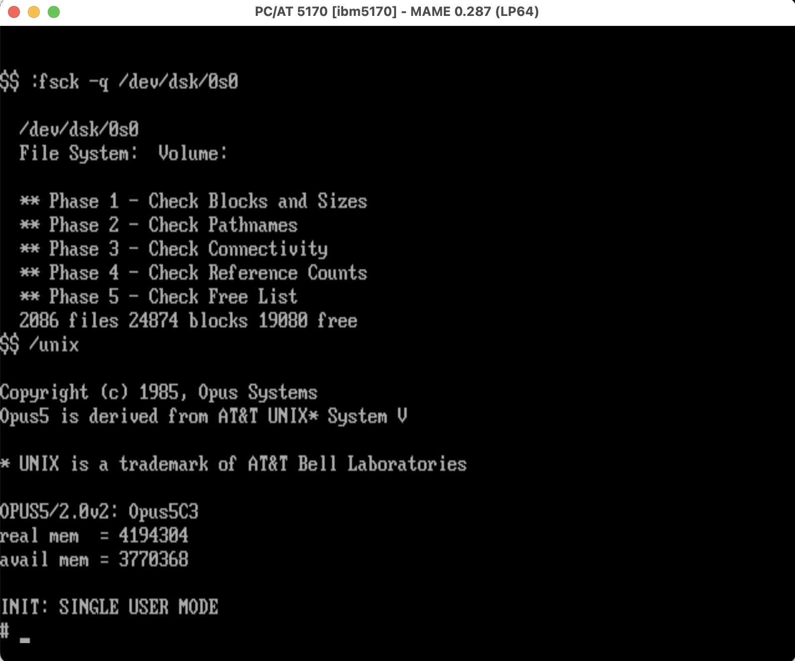

# Opus PM-family media

Runnable media for the Opus Systems "Personal Mainframe" NS32000 coprocessor
cards in MAME (`opus_pm100` = NS32016, `opus_pm110` = NS32032). **Opus5** is
Opus Systems' port of AT&T UNIX System V Release 2.



*Opus5 2.0v2 (`Opus5C3`) booting on the emulated PM-100: `fsck` clean on `/dev/dsk/0s0`,
4 MB RAM, single-user mode.*

Contents:
- `opus5_unix_hd.chd` — a complete, bootable Opus5 hard-disk install.
- `opus5_boot.png` — screenshot of Opus5 running in MAME (above).
- `800-00237-000_Opus_100pm_User_Manual_1987.pdf` — the Opus 100PM manual; the complete
  installation and operation guide (it has everything needed for a bringup).
- `IMPLEMENTATION_NOTES.md` — the real board details and the MAME driver internals.

## opus5_unix_hd.chd

A complete Opus5 installation (100% of the distribution media installed), built in
MAME on the Opus PM-100 (NS32016) card and confirmed booting to `OPUS5/2.0v2: Opus5C3`.

- Geometry: 615 cyl × 6 heads × 17 sec × 512 B = 32,117,760 bytes (~32 MB); CHD for `ide:hdd`.
- CHD SHA1: `8f8b04de3a5940bb0284b1b080d8610842499a7d`
- It is the **flattened standalone** image (base + the MAME install overlay merged via
  `chdman copy -i <install>.dif -ip <base>.chd -o opus5_unix_hd.chd`). Treat it as a
  **read-only master** — MAME writes go to a scratch diff overlay, never the file.

## Bringup

### A. Run the pre-installed image (quickest)

You supply only a **PC/MS-DOS 3.x boot floppy** (not Opus-specific — use the MAME
`ibm5170` DOS software list, or any DOS 3.30 disk image). OPMON and the whole Opus5
system already live on `opus5_unix_hd.chd`.

```
SDL_VIDEODRIVER=dummy ./mame ibm5170 \
  -isa2:fdc:fdc:0 525dd -isa2:fdc:fdc:1 525dd \
  -isa3 opus_pm100 \
  -isa4:ide:ide:0 hdd -hard1 opus/media/opus5_unix_hd.chd \
  -flop1 <pcdos330.img> \
  -diff_directory /tmp/opusdiffs -window
```

Boot DOS, then on `C:` run OPMON to launch Opus5; it banners `OPUS5/2.0v2: Opus5C3`.
Use `-isa3 opus_pm110` to run it on the NS32032 instead (same disk image boots on both).

### B. Build the image from scratch (from the Opus5 distribution)

Get the distribution from bitsavers (below); the full procedure is in the included
manual (Chapter 3 + Appendix A). In short:

1. **Under DOS, run `opinst.bat`** — loads the install floppies onto a partition of the
   hard disk (enough to boot Opus5).
2. **Boot Opus5, then run `opload` under UNIX** — loads the rest of the media onto the
   filesystem.

The driver's **reset-before-run + ~500 ms reset-recovery hold** (see `IMPLEMENTATION_NOTES.md`
§2) is what lets the warm reboot between those steps pass OPMON's Level 1/2 tests.

## Sources (bitsavers.org, preserved by Al Kossow)

- **Manual:** included here (`800-00237-000_Opus_100pm_User_Manual_1987.pdf`); also at
  <http://bitsavers.org/pdf/opusSystems/32k/800-00237-000_Opus_100pm_User_Manual_1987.pdf>
  (`pdf/opusSystems/32k/` also has board photos)
- **Opus5 distribution + install media:** <http://bitsavers.org/bits/OpusSystems/>
  - `opussy5.cpio.Z` — the Opus5 (System V R2) distribution
  - `Floppies/`, `Cartridge_Tapes/` — install media (the miniroot/K1–K3 floppy images live here)
- **Series 32000 family reference / board photos:** <http://cpu-ns32k.net/> (see the *Opus* page)

See `IMPLEMENTATION_NOTES.md` for hardware/model details (108PM/110PM, FCC `32.16-2`/`32.32-4`,
the 1989 `200PM`/`300PM` line, and the "no 32332" finding) and the MAME implementation.

## Credits

- **Opus5** and the Opus PM hardware © Opus Systems; Opus5 is derived from AT&T UNIX
  System V (UNIX is a trademark of AT&T Bell Laboratories).
- Opus5 software and the *Opus 100PM User Manual* preserved by **Al Kossow / bitsavers.org**.
- Hero screenshot (`opus5_boot.png`) and the MAME driver + this disk image: **Dave Rand**.
- Board-level photographs cited in `IMPLEMENTATION_NOTES.md` are from **cpu-ns32k.net**.
