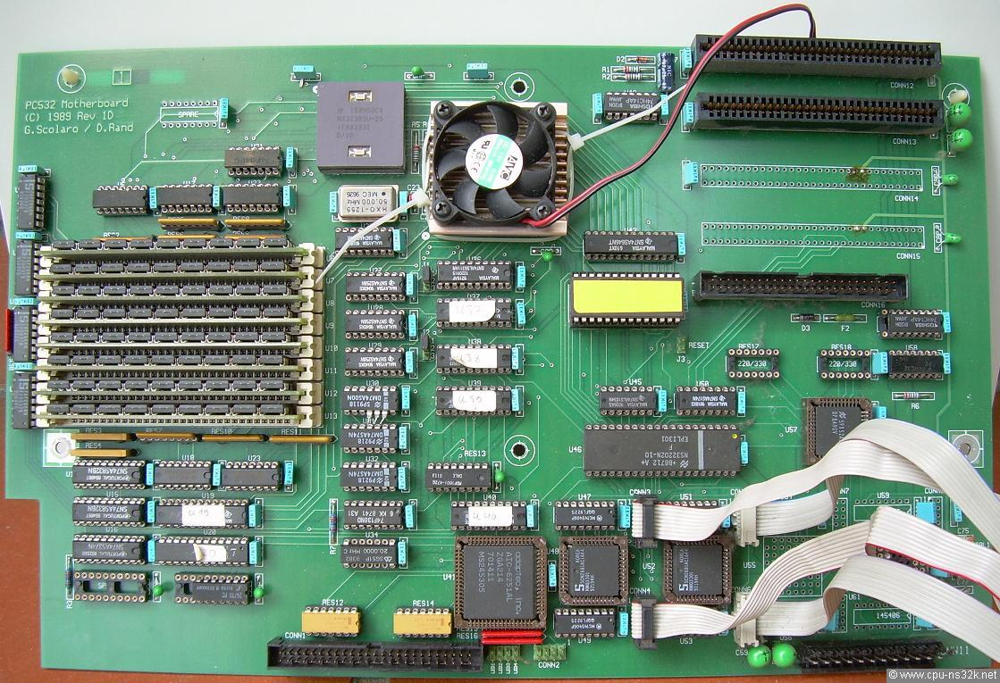
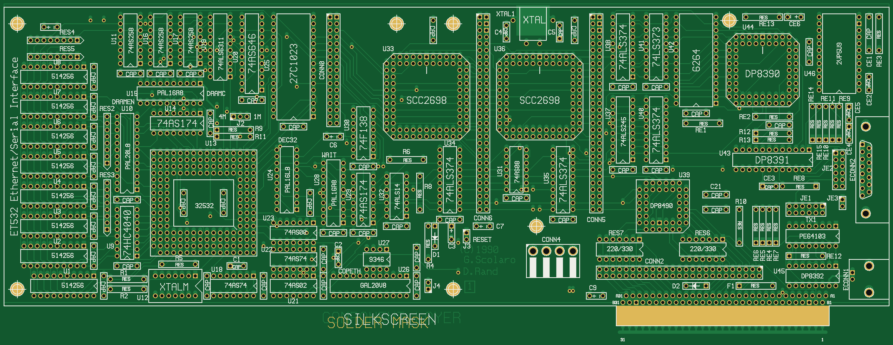
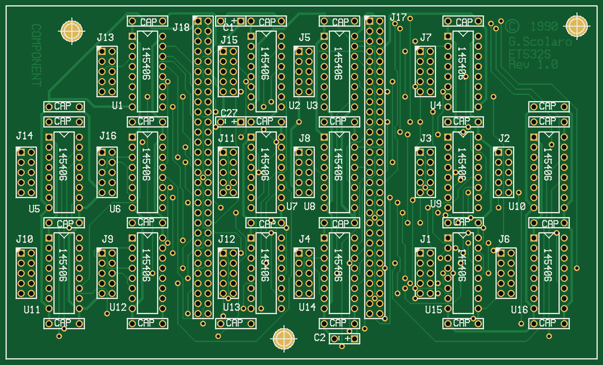

# PC532

The **PC532** ("532 Baby AT") — a hobbyist National Semiconductor **NS32532**
UNIX workstation designed by **George Scolaro and Dave Rand** (c. 1990). A few
hundred boards were built; the community lived on `pc532@daver.bungi.com`. The
board runs NetBSD, Minix and a native System V.



*A populated PC532 ("532 Baby AT"). Photo courtesy of [cpu-ns32k.net](http://www.cpu-ns32k.net/PC532.html).*

MAME system: **`pc532`** (`src/mame/homebrew/pc532.cpp`, by Patrick Mackinlay).

## The hardware (as emulated)

| | |
|---|---|
| CPU | NS32532 @ 25 MHz (50 MHz XTAL / 2) |
| FPU | NS32381 @ 25 MHz |
| Interrupt ctlr | NS32202 ICU |
| Serial | 4 × SCN2681 DUART = 8 serial lines (console on the first) |
| SCSI | NCR DP8490 + AIC6250 |
| RAM | up to 32 MB |
| Boot | ROM monitor / autoboot monitor in a 32 KB EPROM at `u44`; no video — serial console only |

## ROMs (`roms/`)

The board boots a ROM monitor on the serial console. Three versions are preserved
(all 32 KB, 9600 bps console):

| File | Date / author | CRC32 | SHA1 |
|---|---|---|---|
| `911105_9600.u44` | Phil Nelson autoboot monitor, 13 Nov 1991 (MAME default) | `e927cac7` | `90bf5d0e1e86f2a75f7abd4ced7edf8794fa89e5` |
| `900328_9600.u44` | Bruce Culbertson "NS32000 ROM Debugger", 28 Mar 1990 | `63caac86` | `5c7011684b1bce3dd6b5fcf3c81479e40c61c4e3` |
| `culberts_900427_9600.u44` | Bruce Culbertson monitor, Apr 1990 — SCSI fixes (`-bios 900427-9600`) | `50724e69` | `d6f140f1a5414892e4dbb5754da667b70ff90ebe` |

The autoboot monitor (`911105`) is the one NetBSD/pc532 expects; it can autoboot
an OS from a SCSI disk and download programs over the serial line.

### ET532 monitor (`roms/et532/`)

Unlike the pc532 ROMs (real dumps), the ET532 monitor is **built from source** —
the board was never fabricated, so there is no EPROM to dump. `et532mon.a32`
(Definicon DSI-32 assembly) assembles to the 64 KB `et532_monitor.bin`
(CRC `250253af`) that `src/mame/homebrew/et532.cpp` loads: a position-independent
NS32k monitor with console banner/echo, examine/deposit/go, console + block-0
SCSI loaders, and a signature+checksum autoboot. Build steps + the boot-block
format are in [`roms/et532/README.md`](roms/et532/README.md); the hardware
reference is [`docs/et532_hardware.md`](docs/et532_hardware.md) §9.

## Running it

The PC532 has no removable media — you bootstrap an OS over the serial console
via the monitor's `download` command (host computer + serial line, exactly as on
real hardware). `tools/pc532_lib.py` is a small Python harness that does this
through a TCP socket bridge.

Boot to the monitor prompt:

```
cd ~/src/mame
SDL_VIDEODRIVER=dummy ./mame pc532 -serial0 null_modem -bitb socket.127.0.0.1:7000 -video none -nothrottle
# -> "NS32000 ROM Debugger ... Command (? for help):"   (drive it with tools/)
```

### Booting NetBSD 1.5.3 (confirmed working in MAME, 2026)

NetBSD 1.5.3 is the last release to support the PC532. Using `tools/` to drive
the monitor:

```
download 260000                 # monitor; default radix is hex
<stream installation/floppy-144.fs>   then CR   -> "CRC ok, length = 1474560"
run 3be020                      # the boot loader's entry inside the loaded image
>> NetBSD/pc532 Boot, Revision 1.1 ;  answer:  md0a:/netbsd.gz
```

The NetBSD 1.5.3 kernel then boots to a root shell, probes all eight serial
lines and the SCSI bus, and sees the attached disk as `sd0`. Get the
distribution (kernel, `installation/floppy-144.fs`, binary sets) from the NetBSD
archive — it is **not** re-hosted here:

<https://archive.netbsd.org/pub/NetBSD-archive/NetBSD-1.5.3/pc532/>

### Ready-to-run disk (`disks/`)

`disks/pc532_netbsd-1.5.3.chd` is a hard-disk image with NetBSD 1.5.3 already
installed — `mame pc532 -hard disks/pc532_netbsd-1.5.3.chd`, then `boot` at the
monitor boots the OS straight from disk to a `#` shell. It requires a MAME built
with the two ncr5380 SCSI fixes (see `disks/README.md`); a mamedev PR is planned.

See `tools/README.md` for the exact protocol and the harness API.

## Other operating systems

- **Minix 1.3/pc532** — a community port; boots from SCSI disk.
- **System V** — a native NS32000 SVR port (see the ICM-3216 lineage).

## ET532 — the Ethernet/serial variant

The **ET532** is George Scolaro's Ethernet + multiport-serial superset of the
PC532: the same NS32532 CPU cluster + DP8490 SCSI, plus an on-board **DP8390
Ethernet** controller (BNC/Cheapernet + AUI, MAC in a 93C46) and **two SCC2698
octal UARTs = 16 serial lines**. It was designed (rev 1A, 1989) but **never
physically built**; it runs stand-alone (jumper J4) or plugs into a 532 over the
532SC bus.

MAME system: **`et532`** (`src/mame/homebrew/et532.cpp`) — a fresh bring-up of a
board that never existed. The boot monitor is being written from scratch with the
**Definicon DSI-32** NS32k toolchain.

- **[`docs/et532_hardware.md`](docs/et532_hardware.md)** — the hardware reference:
  full memory map, the 74F138 peripheral decode, the COPS/93C46 programming and
  read-out, the interrupt model (no NS32202 — sources OR into the NS32532 `/INT`
  and software polls), and the device/clock summary. Built from George's PALs.
- Design sources in `hardware/`:
  [`et532_schematic.pdf`](hardware/et532_schematic.pdf) (8 sheets); the authoritative
  **RS-274D photoplot gerbers + aperture table** ([`et532_pcb/`](hardware/et532_pcb/),
  the real April-1990 P-CAD output); `et532_gerbers.zip` (a later RS-274X
  re-export); and the PAL equations in [`hardware/et532_pals/`](hardware/et532_pals/)
  (`DEC32`, `COPETH`, `DRAMC`, `DRAMEN`, `WAIT` — PALASM/TDL source).

### How it would have looked

The ET532 was never fabricated, but it ships as a **two-board set** in the
Gerbers, so we can render it from the fab data. Composited from the authoritative
RS-274D photoplot gerbers ([`hardware/et532_pcb/`](hardware/et532_pcb/)) and their
`ether.txt` aperture table — so the pad sizes/shapes (round **and** square) and
trace widths are the real ones — by
[`hardware/render_gerber.py`](hardware/render_gerber.py) (green soldermask, gold
pads, white silkscreen, pad-derived drilled holes):

Both renders use the same pixels-per-inch, and are embedded to scale, so the
serial card's smaller size relative to the main board is accurate.

**Main board** — 13.4 × 5.2 in ("532 Baby AT"): NS32532 cluster, DP8390/DP8391
Ethernet, two SCC2698 octal UARTs, 532SC edge connector.



**Serial card** — 6.0 × 3.6 in (≈44% the width of the main board): 16 × MC145406
RS-232 transceivers and the J1–J18 port connectors.



## Community archives

The PC532 community's primary record, re-hosted for preservation in
[`archive/`](archive/) (all long-public — details in
[`archive/README.md`](archive/README.md)):

- **`archive/bungi.com/`** — Dave Rand's **`pc532`** and **`pc532-src`** mailing
  lists (`pcdig01–76.Z`, Nov 1989 → Oct 1993; `pcsrc.Z` from Sep 1990). The first
  digest opens with the 16-Nov-1989 post that started the project. Read with
  `gzip -dc`; search with `zcat *.Z | grep`.
- **`archive/ftp.funet.fi/`** — a mirror of the funet PC532 FTP archive: NS32k
  toolchain, Bruce Culbertson's monitor/Minix material, hardware docs, and the
  Minix 1.3/1.5 ports.

## Board information

- `docs/` — board notes (`board.md`), the original 10-sheet **schematics**
  ([`PC532_schematics.pdf`](docs/PC532_schematics.pdf)) and **PAL equations**
  ([`PC532_PALs.pdf`](docs/PC532_PALs.pdf)), © 1988-90 George Scolaro — the
  authoritative design reference for the emulation (the PALs define the full
  address decode and the 532SC system-bus signalling). Board photographs are in
  [`docs/images/`](docs/images/) (courtesy cpu-ns32k.net) — see `board.md`.
- `hardware/` — CAD and fabrication sources: Eagle schematic/board, Gerbers, a
  KiCad reproduction, the **ET532** variant (schematic, Gerbers and
  [PAL equations](hardware/et532_pals/) — see the ET532 section above), and the
  related `mini386` FPGA project. See [`hardware/README.md`](hardware/README.md).

## Credits

- **PC532 board** — George Scolaro and Dave Rand.
- **ET532 variant** — George Scolaro (designed 1989, never built); **MAME `et532`
  bring-up** — Dave Rand.
- **ROM monitor / debugger** — Bruce Culbertson (1990); **autoboot monitor and
  the NetBSD/pc532 port** — Phil Nelson (1991).
- **MAME `pc532` driver** — Patrick Mackinlay.
- **NetBSD** — The NetBSD Foundation (BSD licensed; obtain from the archive above).
- **MAME bring-up harness (`tools/`)** — Dave Rand.