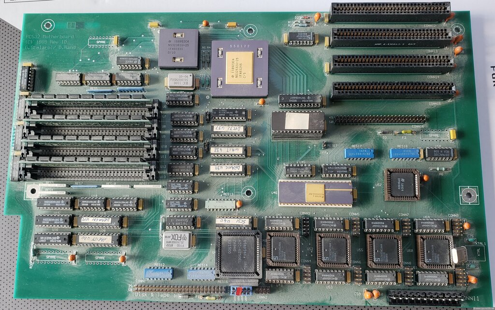

# PC532 board notes

The PC532 ("532 Baby AT") is a hobbyist NS32532 UNIX workstation designed by
**George Scolaro and Dave Rand** (c. 1988-90), distributed to the `pc532`
community (mailing list `pc532@daver.bungi.com`). It is a single-board NS32532
system in PC/AT form factor, powered from a standard PC/AT supply.

## Primary documentation (in this folder)

- **`PC532_schematics.pdf`** — full 10-sheet schematic set, "532 BABY AT",
  © 1988,89 George Scolaro, Rev 1D, 12 Jun 1989.
- **`PC532_PALs.pdf`** — CUPL/equation listings for the six PALs (George Scolaro,
  1988-90): `dec32` (address decode), `dramc`/`dramen` (DRAM RAS-CAS + bank/byte
  enables), `parity`, `scsi` (SCSI pseudo-DMA handshake), `wait` (pseudo-DMA wait
  states). Includes Scolaro's change notes (e.g. the `parity` PAL holds `/NMI`
  asserted across power-on reset because the 32532 only edge-detects `/NMI`).

## Configuration (from the schematics + the MAME `pc532` driver + a NetBSD probe)

```
CPU      NS32532  @ 25 MHz   (U35; 50 MHz XTAL / 2)
FPU      NS32381  @ 25 MHz   (U24)
ICU      NS32202             (U46)
EPROM    27256 (32 KB)       (U44)  monitor / autoboot monitor
DUARTs   4 × SCN2681 (U48/U52/U55/U60), 3.6864 MHz -> 8 serial lines
                             via 145406 RS-232 drivers (CONN3..CONN10)
SCSI     AIC6250 (U41, 20 MHz)  AND  NCR DP8490 (U57)   -- two controllers
DRAM     8 MB array (16 × 1 Mbit + parity); MAME models 32 MB
Parity   74AS280 (U1-U4) + GAL20V8A parity PAL (U20) -> /NMI on error
Power    PC/AT supply (CONN11); 4 status LEDs on a parallel port (PA0-3)
Reset    optional external reset switch (J3)
```

### Two SCSI controllers — important for OS bring-up

The board has **two** SCSI chips, and the schematic notes assign them:
- **AIC6250** (sheet 4): *"for the DISK AND MAG TAPE CONTROLLER BOARDS."*
- **DP8490** (sheet 5): *"for the NEW INTELLIGENT SCSI BOARDS."*

However, **NetBSD/pc532's `ncr` driver is the DP8490** — its INSTALL kernel
probes `ncr0` (DP8490) and finds `sd0`/`st0` there; it does not drive the
AIC6250. So for emulation, disks and tapes must be placed on the **DP8490 bus**
(MAME `pc532`: the `"slot"` NSCSI bus) for NetBSD to see them.

### Memory map (from the `dec32` PAL + the `pc532.cpp` driver)

| Range | Region | Notes |
|---|---|---|
| `0000'0000`–`01ff'ffff` | **DRAM** | up to 32 MB (8 MB populated). At reset the EPROM is **swapped in** at `0` (low 32 KB) so the NS32532 fetches the monitor; the monitor then toggles the swap off and RAM occupies all of `0`. |
| `1000'0000`–`1000'7fff` | **EPROM** | 32 KB 27256 (`U44`), permanently mapped here (independent of the reset swap) |
| `2800'0000`–`2800'003f` | **DUARTs** | 4 × SCN2681, 16 bytes each — duart0 `…00`, duart1 `…10`, duart2 `…20`, duart3 `…30` (8 serial lines) |
| `2800'0050`–`2800'0053` | **parity NMI clear** | a write clears the parity-error `/NMI` latch |
| `3000'0000`–`3000'0007` | **SCSI — DP8490** | NCR5380-family registers — the controller NetBSD and Minix drive |
| `3000'0000`–`3000'0001` | **SCSI — AIC6250** | the alternate controller, mapped in place of the DP8490 (see "Two SCSI controllers" above) |
| `3800'0000`–`3fff'ffff` | **SCSI pseudo-DMA** | CPU-driven pseudo-DMA window (dynamic bus sizing + cycle extension; no DMAC) |
| `ffff'fe00`–`ffff'feff` | **NS32202 ICU** | interrupt controller |

The `dec32` PAL (Scolaro, 05/12/88; `PC532_PALs.pdf` p.3) does this decode from the
high address bits; its only late change enabled the 74AS646 during SCSI pseudo-DMA
— hence Scolaro's Rev-1D note, *"no cuts or jumpers yet."*

### Jumpers

**J3** (the optional external reset switch, above) is the only header of note —
there are **no address or configuration jumpers**: the `dec32` PAL fully decodes
the map and the board self-configures.

## Photographs

A populated PC532, the silkscreen reading **"PC532 Motherboard (C) 1989 Rev 1D
— G. Scolaro / D. Rand"**: the central ceramic NS32532, the DRAM array (left),
the 27256 EPROM, the SCSI and serial peripherals, and the PC/AT edge connectors.


Another board in the wild — period-authentic dust, the bare NS32532 dead centre:



*Photos courtesy of [cpu-ns32k.net](http://www.cpu-ns32k.net/PC532.html).*

## To add (Dave)

- Design history / production-run notes; who did what.

## References

- cpu-ns32k.net PC532 page: <http://www.cpu-ns32k.net/PC532.html>
- NetBSD/pc532 FAQ: <https://www.netbsd.org/ports/pc532/faq.html>
- pc532 archive (funet): <https://www.nic.funet.fi/pub/misc/pc532/>
