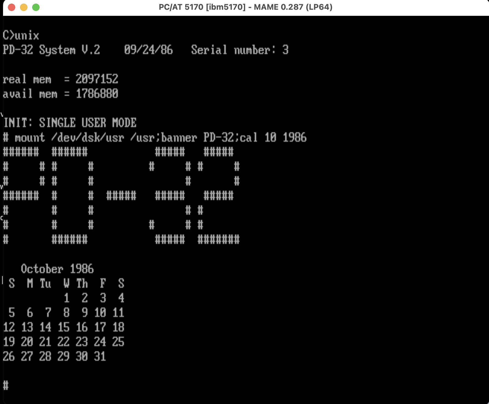

# PD-32 Public-Domain NS32016 Coprocessor (1986)



*AT&T UNIX System V Release 2 (ZAIAZ port) at the single-user prompt
on the emulated PD-32 — serial number 3, the designers' own board —
mounting /usr from a second pack and printing the month the design
was published.*

The PD-32 is a public-domain coprocessor board for the IBM PC, designed
by David L. Rand and George Scolaro and published — schematics, PAL
equations, ROM source and all — in Micro Cornucopia #32
(October-November 1986). It carries a National Semiconductor NS32016
CPU at 10 MHz with NS32081 FPU, NS32082 MMU, and NS32202 ICU, plus
2 MB of DRAM and a 2x2716 boot EPROM, and runs the ZAIAZ port of AT&T
UNIX System V Release 2 with the PC serving console and disk I/O.

Unlike its commercial sibling (the Definicon DSI-32, also in this
collection), the PD-32 was placed in the public domain: the design was
the article, and anyone could build one.

## Architecture

The host interface is a single 74LS646 16-bit transceiver/latch
("a one-byte FIFO"), decoded at I/O ports 170h-176h with A0 ignored:

- **170h** — data latch (byte pairs; the PAL wait-states the host via
  IOCHRDY when writing a full latch or reading an empty one)
- **172h** — write: latching software reset; read: latch-full status
- **174h** — write: INT32, a combinational strobe to the 32016's
  ICU IR13
- **176h** — write: clear service request; read: SREQ status

On the 32016 side the EPROM appears at address 0 after reset; the boot
ROM swaps DRAM into low memory through an ICU general-purpose output
(G1) once the kernel is loaded. The parallel latch lives at FC0000,
the INT86/SREQ doorbell at FC0100, and the ICU at FFFE00. Hardware
wait-states pace both processors against the shared latch, making the
host protocol lockstep by construction.

UNIX sees the host through a request/completion-block protocol
(20-byte parameter blocks): the kernel announces with a sync word and
raises SREQ; UNIX.EXE on the DOS side serves file, raw-floppy, console,
serial, and printer devices.

## What is here

- `roms/` — the two boot EPROMs (v1.7, 1986), as a MAME-ready zip.
- `pals/` — the complete PAL equation set as published: the 32016-side
  decoder (lhudec32), the host-side 646 control pair (646a/646b,
  lhu646), and the DRAM controller (dram).
- `docs/` — Micro Cornucopia #32, the publishing article (the design
  documentation: schematics, theory of operation, construction notes).
- `source/rom/` — the boot ROM source (rom.a32), including the
  load protocol and the EPROM/DRAM swap handoff.
- `source/host/` — the host-side server sources: UNIX.C (loader,
  SysV-filesystem reader), UNIXPR.C (the device server), N32K.ASM
  (the latch primitives), from the designers' working directories.
- `software/boot-floppy/` — boot.img, the 1986 distribution floppy:
  UNIX.EXE, CHPORT.EXE, the ROMs and PALs as shipped (1986-10-07).
- `unix-distribution/` — the complete ZAIAZ UNIX System V R2
  distribution: miniroot plus the full install set (root 1-7,
  usr/bin 1-7, usr/lib 1-6, languages 1-7, man 1-4) as 360K floppy
  images, and fullsys.tar.gz containing the assembled installation.
- `boot-disks/` — ready-to-run MAME media: `pd32-c.chd` (a 20 MB AT
  hard disk with PC-DOS 3.20 and C:\UNIX staged: UNIX.EXE, the
  corrected unixconf, miniroot as the root file, swap), the PC-DOS
  3.20 system floppies used to build it, and
  `pd32-unix-installed.zip` — the complete POST-INSTALL filesystem
  set (5 MB installed root, 10 MB usr, 10 MB guest, the five-device
  unixconf) extracted from the designers\' working system: deploy
  onto two DOS drives and skip the 33-floppy installation entirely.
- `mame-bringup/` — the boot harness: `pd32_first.lua` drives the AT
  through POST, DOS, and the UNIX load headlessly; `unixconf.fixed`
  documents the working configuration (sizes are in 512-byte
  sectors); `load32.py` builds load images from COFF files for
  bench testing.

## MAME status

A new ISA8 card device (`-isa3 pd32`, in `bus/isa/pd32.cpp`) models
the board: NS32016 + 32081 + 32082 + 32202, the 646 latch with
both-direction hardware wait-states (including i86-core IOCHRDY
support added for the purpose), the INT32/SREQ doorbells, and the
EPROM swap. First full UNIX boot 2026-06-11:

```
PD-32 System V.2    09/24/86   Serial number: 3
real mem  = 2097152
avail mem = 1786880
INIT: SINGLE USER MODE
# ls /
bin dev etc mnt pdix tmp unix usr
#
```

with demand paging through the NS32082 and the complete host protocol
(file I/O, bulk transfers both directions, console in and out)
exercised. Quick start:

```
mame ibm5170 -isa3 pd32 -isa4:ide:ide:0 hdd -hard1 boot-disks/pd32-c.chd \
     -isa2:fdc:fdc:0 525dd -flop1 boot-disks/pcdos32-disk1.img
(boot DOS, then:  c:  cd \unix  unix)
```

The bring-up corrected several long-standing MAME device-model gaps
(NS32202 level-tracking interrupt dismissal, NS32082 PTE composition
and interrupt-acknowledge translation, i86 port-I/O wait-states, the
84-key AT keyboard matrix); upstream submissions in progress.

## Provenance

From the personal archives of David L. Rand, co-designer of the board.
The ROMs, PAL equations, ROM source, and host sources are the
designers' own; the design was published as public domain in Micro
Cornucopia #32 (article copyright Micro Cornucopia; preserved here
for historical reference). The UNIX distribution is the ZAIAZ
System V Release 2 port as distributed for the PD-32; UNIX is
copyright AT&T, preserved for historical reference and emulation.
