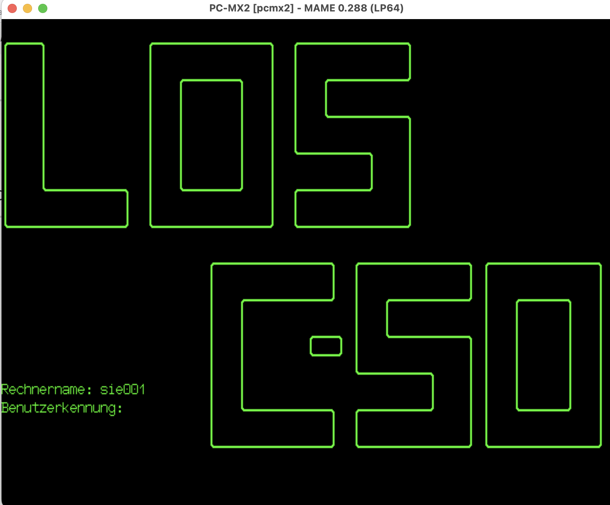
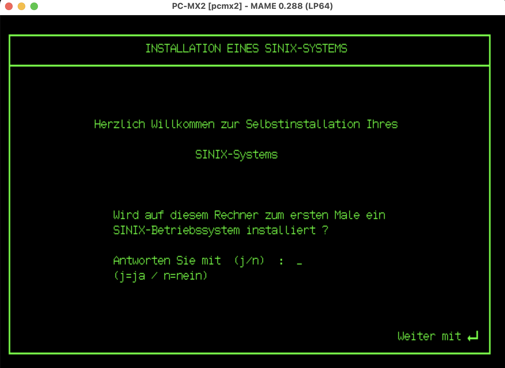

# Siemens PC-MX2

*English version: [README.md](README.md)*

Der **PC-MX2** ist das Mehrplatz-UNIX-System der Siemens AG, aufgebaut um den
National Semiconductor **NS32016** und seine Begleitbausteine der ersten
Series-32000-Generation auf einem Intel-**Multibus**-Rückwandbus, unter dem
Siemens-Betriebssystem **SINIX**. 1985 angekündigt und ab 1986 in Stückzahlen
ausgeliefert, war er eine der Maschinen, die SINIX zu einem der
erfolgreichsten europäischen UNIX-Systeme machten; verkauft mit
Siemens-eigenen 97801-Datensichtstationen, Siemens-Festplatten und
durchgehend deutscher Dokumentation.



*Ein fertig installiertes SINIX-System am Anmeldeprompt (`Benutzerkennung:`),
Rechnername `sie001`, dargestellt auf dem emulierten Siemens-Terminal 97801 mit
seiner charakteristischen großen Umriss-Schrift (MAME 0.288, 2026): der erste
PC-MX2 seit Jahrzehnten, der sich anmeldet.*

MAME-System: **`pcmx2`** (`src/mame/siemens/pcmx2.cpp`, von Patrick
Mackinlay), erweitert um die in diesem Archiv dokumentierte Gerätearbeit
(SERAD, Storager, 97801-Terminal). Die Geschichte der Wiederbelebung steht in
[`docs/BRINGUP.de.md`](docs/BRINGUP.de.md) (englische Fassung: [`docs/BRINGUP.md`](docs/BRINGUP.md)).

## Zeittafel

| Datum | Ereignis | Quelle |
|---|---|---|
| 1982 | Der NS32016 kommt auf den Markt, der erste 32-Bit-Mikroprozessor für den allgemeinen Einsatz | Series-32000-Geschichte |
| 1984 | SINIX vorgestellt (zunächst Xenix-basiert, auf dem 80186-PC-X) | SINIX-Geschichte (Wikipedia) |
| 1985 | PC-MX2 angekündigt; SINIX-Schnittstellen-Handbücher datiert 12/1985 | lokaler Handbuchsatz (`U2300-J-Z95-1`, 12-1985) |
| 12.02.1986 | `/etc/init` der Installationsdiskette; `init.c 1.17`, SCCS 18.02.1986 | wiederhergestellte Programmdatei |
| 22.04.1986 | Kernel-Übersetzung SINIX-M-C V2.0 (Rev. 266), der Kernel der Installationsdiskette | Kernel-Meldung |
| März–Mai 1986 | Die SINIX-V2.0/PC-MX2-Distributionsdisketten im Umlauf (Sätze datiert 12.03.86 / 12.05.86) | Diskettenetiketten (OldComputers-Spiegel) |
| März 1987 | Betriebsanleitung „Ausgabe März 1987 (PC-MX2 V2.1A)", U2606-J-Z96-2 | lokales Handbuch |
| 1989 | PC-MX2 nicht mehr im Siemens-SINIX-Angebot (abgelöst durch MX300/MX500) | Siemens-Magazin COM 4/89 via cpu-ns32k.net |

## Die Hardware (wie emuliert)

| | |
|---|---|
| CPU-Baugruppe | **CPUAP** (S26361-**D333**): NS32016 mit 10 MHz, NS32082 MMU, NS32081 FPU, NS32202 ICU |
| Arbeitsspeicher | 1 MB paritätsgesicherter DRAM auf der CPUAP (256-kBit-Bausteine); Erweiterung **MEMAD D303** (1 oder 3 MB) über einen eigenen 50-poligen Speicherbus → Ausbaustufen 1/2/4 MB |
| Rückwandbus | Intel Multibus (die MEMAD bezieht daraus nur die Versorgung; Daten laufen über den 50-poligen Bus) |
| Serielle E/A | **SERAD**-E/A-Prozessor: Intel 8085 + SCN2681-DUARTs, Host-Postfach bei Multibus `0xEF7000`; bedient die 97801-Terminals |
| Platten | **Storager**-Controller: intelligenter Disketten- und Festplattencontroller mit Motorola 68000 (Kommandoprotokoll nach Interphase-Art); 5¼"-Disketten + ESDI-Winchester |
| Terminals | Siemens-Datensichtstationen **97801** (proprietäres Protokoll; ein VT100 funktioniert nicht), jede mit abgesetzter serieller Tastatur mit eigenem MCS-48-Mikrocontroller |
| Betriebssystem | **SINIX** V2.0/V2.1, das Siemens-UNIX, ab V2 mit den „Universen" (mehrere UNIX-Dialekte wählbar) |

Ein lehrreiches Detail: Das Hochfahren eines PC-MX2-Arbeitsplatzes bedeutet
**fünf gleichzeitig laufende Prozessoren — fünf verschiedene
Prozessorarchitekturen**, drei im Hauptsystem und zwei weitere im Terminal
auf dem Schreibtisch:

1. **NS32016** (CPUAP), der Series-32000-Hauptprozessor, mit NS32082-MMU und
   NS32081-FPU als Slave-Prozessoren;
2. **Intel 8085** (SERAD), mit der Firmware der seriellen E/A;
3. **Motorola 68000** (Storager), mit der Firmware des Plattencontrollers;
4. **SAB8031** (MCS-51, 11,0592 MHz) im Terminal 97801, das den
   SCN2672B-Videocontroller, die Host-Schnittstelle und die
   Tastaturschnittstelle bedient;
5. **MAB 8035HL** (MCS-48) in der abgesetzten Tastatur des Terminals, der die
   Tastenmatrix abtastet, die Umschaltebenen auflöst und die serielle
   Verbindung zum Terminal (600 Baud) bedient.

Jeder von ihnen führt seine originale, unveränderte Firmware der
1980er-Jahre aus.

Eine spätere PC-MX2-Variante verwendete den NS32332 mit 15 MHz. Die größere
MX300/MX500-Familie (NS32332, später NS32532) folgte nach.

## ROMs (`roms/`)

CPUAP-Bootmonitor, beide erhaltenen Stände; `cpuap.zip` ist der
CRC-geprüfte MAME-Romsatz (`-slot6 cpuap,bios=rev9` / `rev3`):

| Datei | Version | CRC32 | SHA1 |
|---|---|---|---|
| `361d0333d053__e01735_ine.d53` | D333-Monitor Rev 9.0 (16.06.1988), High-Byte | `b5eefb64` | `a71a7daf9a8f0481d564bfc4d7ed5eb955f8665f` |
| `361d0333d054__e01725_ine.d54` | D333-Monitor Rev 9.0 (16.06.1988), Low-Byte | `3a3c6b6e` | `5302fd79c89e0b4d164c639e2d73f4b9a279ddcb` |
| `d333__d55_g53__hb.d55` | D333-Monitor Rev 3 (09.12.1985), High-Byte | `821e1e41` | `0800249eab8db490c1fb6fea6d65bc7e874c9a0c` |
| `d333__d56_g53__lb.d56` | D333-Monitor Rev 3 (09.12.1985), Low-Byte | `0892ff90` | `e84ceb8eb3c13de3692297c46632dbfafaad675f` |

Ebenfalls als CRC-geprüfte MAME-Romsätze vorhanden: `serad.zip` (serielle
E/A-Baugruppe SERAD, S26361-D279) und `storager.zip` (Interphase 3030 Storager,
vier BIOS-Stände, drei davon ausgelesen). Weiterhin für künftige Treiberarbeit
abgelegt: die Firmware des OMTI-5400-SASI-Controllers und die ROMs der
ExeLAN-Ethernet-Baugruppe. Herkunfts- und BIOS-Auswahlhinweise in
[`roms/README.txt`](roms/README.txt).

## Das Terminal 97801 (`terminal-97801/`)

Die Konsole des PC-MX2 ist nicht mit einem gewöhnlichen RS-232-Terminal
kompatibel: SINIX steuert die Siemens 97801 mit einem proprietären Protokoll
an, einschließlich vom Rechner heruntergeladener Tastaturtabellen.
`terminal-97801/` enthält die 97801-ROM-Auslesungen (Programm,
Zeichengenerator und der K111-V1-Tastaturcontroller) hinter den MAME-Geräten
`s97801` und `s97801_kbd` — Low-Level-Emulation bis ganz nach unten: der
SAB8031 des Terminals führt seine eigene Firmware aus, und selbst die
abgesetzte Tastatur ist ein echter emulierter MAB 8035HL, der die
K111-Firmware (internationale Variante) ausführt und sich beim Einschalten
über die emulierte serielle Verbindung gegenüber dem Terminal selbst testet
und identifiziert, genau wie das echte Gerätepaar. Das Terminal dient als
SINIX-Systemkonsole (der Anmelde- und der Installationsbildschirm oben werden
über sie dargestellt). Siehe
[`terminal-97801/README.md`](terminal-97801/README.md) (englisch).

## Handbücher (`docs/manuals/`)

Der zentrale Siemens-Dokumentationssatz (deutsch), gespiegelt vom
OldComputers-Archiv, mit durchsuchbarem `pdftotext`-Auszug unter
`docs/manuals/text/`: Betriebsanleitung (3/1987), Installationsanleitung (der
Leitfaden, an dem die emulierte Installation geprüft wurde), das
PC2000/9780-Logikhandbuch, die Serviceunterlagen zum Abteilungsrechner
7500-C30 (Quelle der CPUAP/MEMAD-Speicherarchitektur), das
Transdata-9780-Wartungshandbuch, die DUEAI-Bände zum E/A-Prozessor, das
SINIX-Schnittstellen-Benutzerhandbuch und die OMTI-5000-Referenz. Die beiden
großen SINIX-Bücher (Buch 1/Buch 2) sind hier nicht dupliziert; sie finden
sich im selben OldComputers-Spiegel.

## Datenträger (hier nicht erneut veröffentlicht)

Die SINIX-V2.0/PC-MX2-Distributionsdisketten (Installationssatz
SINIX0–SINIX7, CES, MES und Anwendungssätze; IMD-Abbilder, datiert März–Mai
1986) werden hier **nicht erneut veröffentlicht**; SINIX ist proprietäre
Software von Siemens (später Fujitsu). Sie sind erhalten unter:

> `https://oldcomputers.dyndns.org/public/pub/rechner/siemens/mx-rm/pc-mx2/`

Die MAME-Wiederbelebung bootet die unveränderte SINIX0-Diskette
(`mx2-001.imd`) aus diesem Satz.

## Inbetriebnahme

Mit den ROMs im Rompfad und dem SINIX0-Diskettenabbild:

```sh
mame pcmx2 -slot6 cpuap,bios=rev3 <Disketten-/Terminal-Optionen gemäß Treiber>
```

Der Startablauf: CPUAP-Selbsttest → NSC-Bootlader von Diskette
(`Load: text+data`) → `Boot: sa(22,0)sinix` → SINIX-M-C-V2.0-Kernel →
Dialog `INSTALLATION EINES SINIX-SYSTEMS`. Die Speichermeldung einer
4-MB-Maschine lautet `System 734k User 3362k / using 143 buffers`, in
Übereinstimmung mit der realen Hardware.



*Der SINIX-V2.0-Selbstinstallationsdialog („Herzlich Willkommen zur
Selbstinstallation Ihres SINIX-Systems"), gebootet von der
Original-Installationsdiskette von 1986.*

### Anmeldung

Ist ein installiertes System hochgefahren, meldet man sich mit einer der beiden
Verwaltungskennungen an:

| Benutzerkennung | Rolle |
|---|---|
| `root` | Superuser |
| `admin` | menügeführte Systemverwaltung |

Die Handbücher (Betriebsanleitung und Installationsanleitung) nennen als
Standardkennwort **`siemens`** (in Kleinbuchstaben). Das `/etc/passwd` des
ausgelieferten Systems sagt jedoch etwas anderes: Der Kennworthash
`jj3vHL1rEcKG6` ist ein gewöhnlicher DES-`crypt` von **`murphy`** (Salt `jj`),
nachprüfbar mit `crypt("murphy", "jj")`. Auf den erhaltenen Datenträgern lautet
das gültige Kennwort also `murphy`, nicht das dokumentierte `siemens`; eine
kleine Kuriosität der Überlieferung, gut zu wissen, bevor man sich aus einem
vierzig Jahre alten UNIX-System aussperrt.

## Danksagung

- **Patrick Mackinlay**, der MAME-Treiber `pcmx2` und die
  NS32000-CPU/MMU-Emulation.
- **OldComputers (oldcomputers.dyndns.org)**, Bewahrung der PC-MX2-ROMs,
  -Handbücher und der SINIX-Diskettensätze, auf denen diese Arbeit beruht.
- **Udo Möller / cpu-ns32k.net**, Series-32000-Bewahrung,
  Baugruppendokumentation und die Auslesung des Rev-9.0-Monitors.
- **Plamen Mihaylov** (MAME-Entwickler), eigene Fotografien der
  PC-MX2-Baugruppen und -Systeme aus seiner Sammlung.
- **Dave Rand**, Geräteemulation (SERAD, Storager, 97801), die
  SINIX-Wiederbelebung und die NS32000-RETT/RETI-Korrektur, die init am Leben
  ließ.

## Lizenz

Eigenes Material in diesem Ordner (Notizen, Analysen,
Wiederbelebungsdokumentation) steht unter **CC-BY-4.0** (Dave Rand).
Siemens-Handbücher und ROM-Abbilder sind in gutem Glauben zum Zweck der
Emulation und der historischen Bewahrung eines seit über drei Jahrzehnten
nicht mehr hergestellten Systems beigefügt; sie bleiben Eigentum ihrer
Rechteinhaber und werden auf Wunsch entfernt. SINIX selbst wird hier nicht
erneut veröffentlicht (siehe oben).
