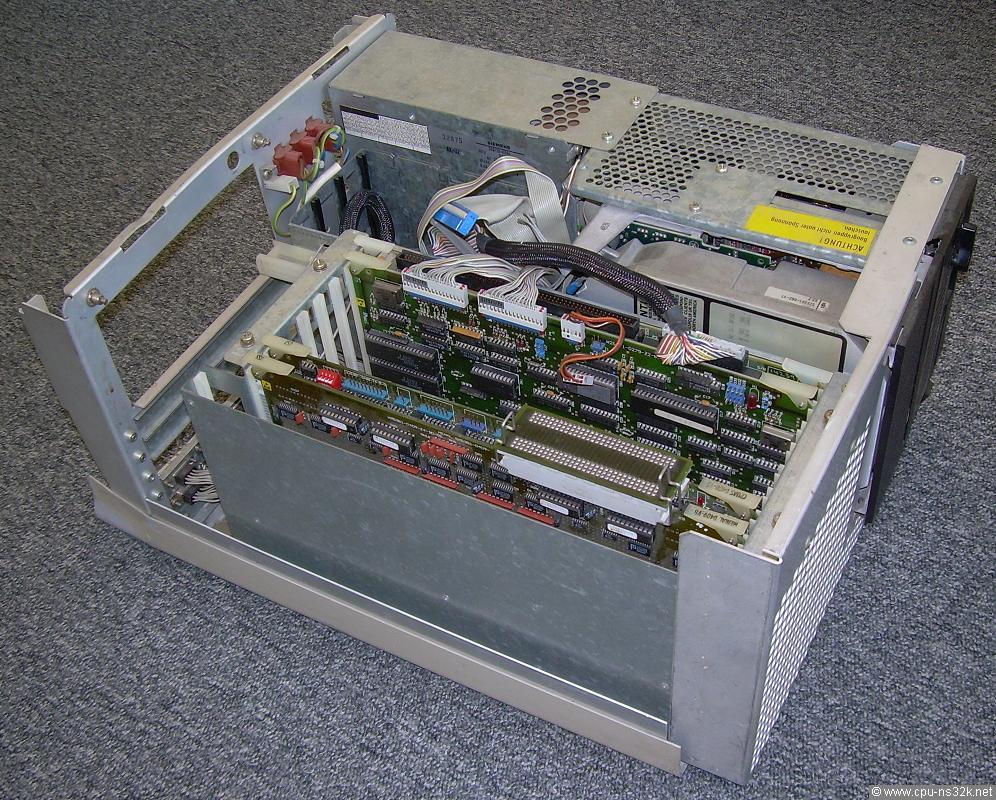

# Siemens PC-MX2

*Deutsche Fassung: [README.de.md](README.de.md)*

The **PC-MX2** is Siemens AG's desk-side multi-user UNIX system, built around the
National Semiconductor **NS32016** and its first-generation Series 32000
companion chips on an Intel **Multibus** backplane, running Siemens'
**SINIX** operating system. Announced in 1985 and shipping in volume through
1986–1988, it was one of the machines that made SINIX a major European UNIX,
sold with Siemens' own 97801 terminals, Siemens-built hard disks, and German
documentation end to end.


*A fully installed SINIX system at the login prompt (`Benutzerkennung:`),
hostname `sie001`, rendered on the emulated Siemens 97801 terminal with its
distinctive large outline-font banner (MAME 0.288, 2026): the first PC-MX2 to
log in anywhere in decades.*



*Inside the PC-MX2: the Multibus card cage with the CPUAP (CPU), MEMAD
(memory expansion), SERAD (serial I/O processor) and Storager (disk
controller) boards.*

MAME system: **`pcmx2`** (`src/mame/siemens/pcmx2.cpp`, by Patrick Mackinlay),
extended by the device work in this archive's history (SERAD, Storager, 97801
terminal). In 2026 the machine boots SINIX V2.0 from the original install
floppies to the installation dialog, believed to be the first PC-MX2 boot
anywhere since the early 1990s. The bring-up story is in
[`docs/BRINGUP.md`](docs/BRINGUP.md).

## Dates

| Date | Event | Source |
|---|---|---|
| 1982 | NS32016 reaches market, the first general-purpose 32-bit microprocessor | Series 32000 history |
| 1984 | SINIX introduced (initially Xenix-derived, on the 80186 PC-X) | SINIX history (Wikipedia) |
| 1985 | PC-MX2 announced; SINIX interface manuals dated 12/1985 | local manual set (`U2300-J-Z95-1`, 12-1985) |
| 12 Feb 1986 | `/etc/init` on the install floppy; `init.c 1.17`, 18 Feb 1986 SCCS | recovered binary |
| 22 Apr 1986 | SINIX-M-C V2.0 (Rev. 266) kernel build, the install-floppy kernel | kernel banner |
| Mar–May 1986 | The SINIX V2.0/PC-MX2 distribution floppies in circulation (sets dated 12.03.86 / 12.05.86) | disk labels (oldcomputers mirror) |
| Mar 1987 | Betriebsanleitung "Ausgabe März 1987 (PC-MX2 V2.1A)", U2606-J-Z96-2 | local manual |
| 1989 | PC-MX2 no longer in the Siemens SINIX price list (superseded by MX300/MX500) | Siemens-Magazin COM 4/89 via cpu-ns32k.net |

## The hardware (as emulated)

| | |
|---|---|
| CPU board | **CPUAP** (S26361-**D333**): NS32016 @ 10 MHz, NS32082 MMU, NS32081 FPU, NS32202 ICU |
| RAM | 1 MB parity DRAM on the CPUAP (256-kbit chips); **MEMAD D303** expansion (1 or 3 MB) over a private 50-pin memory bus → 1/2/4 MB configurations |
| Backplane | Intel Multibus (MEMAD draws only power from it; data goes over the 50-pin bus) |
| Serial I/O | **SERAD** I/O processor: Intel 8085 + SCN2681 DUARTs, host mailbox at Multibus `0xEF7000`; drives the 97801 terminals |
| Disk | **Storager** controller: Motorola 68000-based intelligent floppy + hard-disk controller (Interphase-style command protocol); 5¼" floppies + ESDI Winchester |
| Terminals | Siemens **97801** block terminals (proprietary protocol; a VT100 will not work), each with a detached serial keyboard driven by its own MCS-48 microcontroller |
| OS | **SINIX** V2.0/V2.1, Siemens UNIX with the V2 "universes" (multiple UNIX dialect personalities) |

Instructive detail: booting one PC-MX2 seat means emulating **five
processors — five different CPU architectures — running concurrently**,
three in the main system and two more in the terminal on your desk:

1. **NS32016** (CPUAP), the Series 32000 main processor, with its NS32082 MMU
   and NS32081 FPU slave processors;
2. **Intel 8085** (SERAD), running the serial I/O firmware;
3. **Motorola 68000** (Storager), running the disk-controller firmware;
4. **SAB8031** (MCS-51, 11.0592 MHz) in the 97801 terminal, driving an
   SCN2672B video controller, the host link, and the keyboard link;
5. **MAB 8035HL** (MCS-48) in the terminal's detached keyboard, scanning the
   key matrix, resolving the shift levels, and speaking the 600-baud serial
   link to the terminal.

Every one of them executes its original 1980s firmware, unmodified.

A later PC-MX2 variant used the NS32332 @ 15 MHz. The larger MX300/MX500
family (NS32332, later NS32532) succeeded it.

## ROMs (`roms/`)

CPUAP boot monitor, both preserved revisions; `cpuap.zip` is the
CRC-verified MAME romset (`-slot6 cpuap,bios=rev9` / `rev3`):

| File | Version | CRC32 | SHA1 |
|---|---|---|---|
| `361d0333d053__e01735_ine.d53` | D333 Monitor Rev 9.0 (16.06.1988), high byte | `b5eefb64` | `a71a7daf9a8f0481d564bfc4d7ed5eb955f8665f` |
| `361d0333d054__e01725_ine.d54` | D333 Monitor Rev 9.0 (16.06.1988), low byte | `3a3c6b6e` | `5302fd79c89e0b4d164c639e2d73f4b9a279ddcb` |
| `d333__d55_g53__hb.d55` | D333 Monitor Rev 3 (09.12.1985), high byte | `821e1e41` | `0800249eab8db490c1fb6fea6d65bc7e874c9a0c` |
| `d333__d56_g53__lb.d56` | D333 Monitor Rev 3 (09.12.1985), low byte | `0892ff90` | `e84ceb8eb3c13de3692297c46632dbfafaad675f` |

Also here as CRC-verified MAME romsets: `serad.zip` (SERAD serial-I/O board,
S26361-D279) and `storager.zip` (Interphase 3030 Storager, four BIOS revisions,
three dumped). Still staged for future driver work: the OMTI 5400 SASI
controller firmware and the ExeLAN Ethernet board ROMs. Provenance and
BIOS-selection notes in [`roms/README.txt`](roms/README.txt).

## The 97801 terminal (`terminal-97801/`)

The PC-MX2's console is not RS-232-dumb-terminal compatible: SINIX drives the
Siemens 97801 with a proprietary protocol including host-downloaded keyboard
tables. `terminal-97801/` holds the 97801 ROM dumps (program, character
generator, and the K111-V1 keyboard controller) behind the MAME `s97801` and
`s97801_kbd` devices — low-level emulation all the way down: the terminal's
SAB8031 runs its own firmware, and even the detached keyboard is a real
emulated MAB 8035HL executing the K111 International-variant firmware,
self-testing and identifying itself to the terminal over the emulated serial
link at power-up, exactly as the hardware pair did. The terminal serves as
the SINIX system console (the login and install screenshots above are
rendered through it). See
[`terminal-97801/README.md`](terminal-97801/README.md).

## Manuals (`docs/manuals/`)

The core Siemens documentation set (German), mirrored from the OldComputers
archive with searchable `pdftotext` output under `docs/manuals/text/`:
Betriebsanleitung (operation, 3/1987), Installationsanleitung (the install
walkthrough used to validate the emulated install), the PC2000/9780 logic
manual, the 7500-C30 service documentation (source of the CPUAP/MEMAD memory
architecture), the Transdata 9780 maintenance handbook, the DUEAI I/O
processor volumes, the SINIX interfaces manual, and the OMTI 5000 reference.
The two large SINIX user books (Buch 1/Buch 2) are not duplicated here; get
them from the same OldComputers mirror.

## Media (not re-hosted)

The SINIX V2.0/PC-MX2 distribution floppies (SINIX0–SINIX7 install set, CES,
MES, and application sets, IMD images dated March–May 1986) are **not
re-hosted here**; SINIX is Siemens (later Fujitsu) proprietary software.
They are preserved at:

> `https://oldcomputers.dyndns.org/public/pub/rechner/siemens/mx-rm/pc-mx2/`

The MAME bring-up boots the unmodified `mx2-001.imd` SINIX0 floppy from that
set.

The **SINIX-S3510 V2.1** service/data-communications suite (18-disk ImageDisk
set, media dated 16.01.1989, Best-Nr. P30357-A3001-S21) is a Siemens application
layer that installs *on top of* a base SINIX V2.0 system — `SERV01–14` service
packages (terminal-session management, server↔terminal file transfer, BS2000
emulation, LPR spooling), `TERM1` (97801 terminal firmware load + chipcard),
`STYPTA` (9750 and 3270/3278 terminal emulation, TRANSIT datacomm), and `ZTRUP`
(telephone-register update). Its boot disk carries the same `SINIX 2.0 Series
32000` (NS32000) kernel base. No other public source for this media is known, so
it is preserved on the Internet Archive — in good faith, for historical
emulation, **removable on request by a rights holder**:

> https://archive.org/details/siemens-pc-mx2-sinix-s3510

The SINIX-S3510 disk images are courtesy of **Plamen Mihaylov**.

## Running it

With the ROMs in your rompath and the SINIX0 floppy image staged:

```sh
mame pcmx2  <floppy/terminal options per the driver>
```

Boot proceeds: CPUAP self-test → NSC boot loader from floppy
(`Load: text+data`) → `Boot: sa(22,0)sinix` → SINIX-M-C V2.0 kernel →
`INSTALLATION EINES SINIX-SYSTEMS` dialog. Memory sizing on a 4 MB machine
reports `System 734k User 3362k / using 143 buffers`, matching the real
hardware figures.


*The SINIX V2.0 self-installation dialog ("Herzlich Willkommen zur
Selbstinstallation Ihres SINIX-Systems"), booted from the original 1986
install floppy.*

### Logging in

Once an installed system is up, log in with one of the two administrative
accounts:

| Login | Role |
|---|---|
| `root` | superuser |
| `admin` | menu-driven system administration |

The manuals (Betriebsanleitung and Installationsanleitung) give the default
password as **`siemens`** (lowercase). The shipped system's `/etc/passwd`,
however, tells a different story: the password hash `jj3vHL1rEcKG6` is a
standard DES `crypt` of **`murphy`** (salt `jj`), verifiable with
`crypt("murphy", "jj")`. So on the preserved media the working password is
`murphy`, not the documented `siemens`, a small preservation curiosity worth
knowing before you are locked out of a forty-year-old UNIX box.

## Credits

- **Patrick Mackinlay**, the MAME `pcmx2` driver and NS32000 CPU/MMU emulation.
- **OldComputers (oldcomputers.dyndns.org)**, preservation of the PC-MX2
  ROMs, manuals, and the SINIX floppy sets this work stands on.
- **Udo Möller / cpu-ns32k.net**, Series 32000 preservation, board
  documentation and the Rev 9.0 monitor dump.
- **Plamen Mihaylov** (MAME developer), direct photographs of the PC-MX2
  boards and systems in his collection, and the SINIX-S3510 V2.1 floppy images.
- **Dave Rand**, device emulation (SERAD, Storager, 97801), the SINIX
  bring-up, and the NS32000 RETT/RETI fix that let init live.

## Licensing

Original material in this folder (notes, analysis, bring-up documentation) is
**CC-BY-4.0** (Dave Rand). Siemens manuals and ROM images are included in good
faith for emulation and historical preservation of a system out of production
for over three decades; they remain the property of their rights holders and
will be removed on request. SINIX itself is not re-hosted (see Media above).