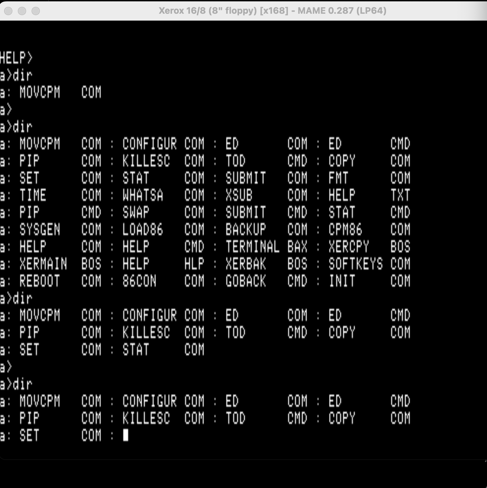

# Xerox 820-II 16/8

Everything in one place for emulating and understanding the **Xerox 16/8** — a
Xerox 820-II (Z80, CP/M-80) with the **"816 PC"** 8086 coprocessor board
(CP/M-86 or MS-DOS) bolted on, the two processors linked by a shared-RAM doorbell
mailbox.

This folder is deliberately broader than the rest of this repo. The 16/8 had so
many missing or scattered pieces — a bad u35 dump, undumped ROMs, no extracted
firmware source, no documented disk format, no keyboard spec — that the point
here is to **collect all of it in one place with provenance**, so the next person
(or the next bring-up session) doesn't have to rediscover it. Documents will be
corrected as the bring-up continues; the goal is to stop duplicative effort.

## Layout

| Folder | Contents |
|---|---|
| [`roms/`](roms/) | All boot/firmware ROMs (Z80 monitor v5.0 + v4.04, 8086 "816 PC", character generators, keyboard 8748), with CRC/SHA1 and provenance. |
| [`disks/`](disks/) | TeleDisk `.td0` software set (5.25"/8") + the Don Maslin source/dev `.IMD` disks. |
| [`source/`](source/) | The complete **Balcones OS v5.0 ("RX") ROM source**, extracted from disk B23D13, plus the 8086 boot-ROM disassembly and the `imd2flat.py` tool. |
| [`docs/`](docs/) | The **X928 ASCII keyboard** interface spec, the **Z80↔8086 architecture / mailbox** reference, the **RX024 5.25" disk-controller** reconstruction, the **solved 5.25" boot-disk format**, and the **SASI rigid-disk system** (adapter, controller, partitions, install flow). |
| [`boot-disk/`](boot-disk/) | The **reconstructed, booting** 5.25" CP/M-80 disk for `x1685` (+ the base-820-II variant), with the full byte-provenance recipe. |

## Machines in MAME

All of these are in mainline MAME and marked working — merged in
[mamedev/mame#15485](https://github.com/mamedev/mame/pull/15485).

| MAME system | Media | Status |
|---|---|---|
| `x168` | 8" floppy | Boots Balcones CP/M-80 to `A>` **and boots CP/M-86 1.1F on the 8086** (`LOAD86` → `86CON`), interactive (`a>`, `DIR`). Boot media: `16-8sys8` (the v5.0 monitor is the default BIOS). |
| 8086 "816 PC" board | — | POSTs to "816 PC Ok", and the Z80↔8086 mailbox is worked out far enough to **load and run CP/M-86 with full console + disk I/O**. See [`docs/16-8-architecture.md`](docs/16-8-architecture.md). |
| `x1685` | 5.25" floppy | **Boots Balcones CP/M 2.2 to an interactive `A>`** from the reconstructed boot disk in [`boot-disk/`](boot-disk/). Controller ROM reconstructed from recovered driver source ([`docs/16-8-rx024-controller.md`](docs/16-8-rx024-controller.md)). See [`docs/16-8-boot-disk-format.md`](docs/16-8-boot-disk-format.md). |
| `x820iis` | 8" SASI (floppies + rigid over SASI) | **Boots CP/M 2.2 over SASI**; floppy read/write/format proven (INIT works); rigid serves an 8 MB SA1004-class CHD. See [`docs/sasi-rigid-system.md`](docs/sasi-rigid-system.md). |
| `x168s` | 5.25" SASI rigid unit | **Boots CP/M 2.2 from a rigid partition** (`LE`; partition E becomes A:) through the reconstructed `sdvr` driver. Floppy *cold boot* needs the undumped rgd5 boot media. See [`docs/sasi-rigid-system.md`](docs/sasi-rigid-system.md). |
| `x168em` | Expansion Module II (5.25" ST-506 rigid + floppy) | The historically-correct 5.25" rigid box: a slot-connected **WD1002-05** controller with the genuine **537P3682** box ROM. **Boots CP/M 2.2 from the EM-II 5.25" floppy** ([`disks/emiidia5.td0`](disks/)); the ST-506 rigid is served by the same WD1002-05 model. |

## Highlights / what was recovered here

- **A clean `u35` boot ROM.** The widely-circulated `l5.u35` dump has data bit 7
  stuck high; the correct part (`278fa75f`) is in [`roms/z80-monitor/v50/`](roms/z80-monitor/v50/),
  confirmed against the assembled copy on the source disk.
- **The v5.0 firmware source**, never (to my knowledge) previously extracted —
  including the disk drivers, the SASI rigid-disk driver, and the DPB tables.
  Reading the double-sided 8" disks needed a non-obvious head-grouped track
  order; the verified `imd2flat.py` + cpmtools diskdef are documented in
  [`source/README.md`](source/README.md).
- **The X928 ASCII keyboard fully specified** — strobe protocol, the `0x9E`
  power-on hello, both selectable layouts — reverse-engineered from the Tech Ref
  BIOS and the 8748 ROM. On its own this is enough to recreate a compatible
  keyboard: [`docs/x928-keyboard.md`](docs/x928-keyboard.md).  (The position-encoded
  **G25** Low Profile Keyboard is a separate keyboard — see the
  `Xerox-820-line-roms` README.)
- **The 5.25" boot disk reconstructed and booting** — the shipping warm-boot
  walk disassembled, the CCP/BDOS relocation recovered as a byte-diff bitmap of
  the two linked images, every byte of the disk provenance-tracked:
  [`docs/16-8-boot-disk-format.md`](docs/16-8-boot-disk-format.md).
- **The SASI rigid system worked out end-to-end** — host adapter, controller
  command set, partitioning, the install flow, and a rigid-partition boot on
  the 5.25" machine via the rebuilt `sdvr` driver:
  [`docs/sasi-rigid-system.md`](docs/sasi-rigid-system.md).
- **The real 5.25" rigid box identified and modeled.** The 16/8's 5.25"
  rigid unit is the **Expansion Module II** — a slot-connected WD1002-05
  Winchester controller, not the 8" SA1403D/SASI chain — and its genuine
  **537P3682** box ROM was located, so `x168em` runs the real firmware
  against a WD1002-05 device model.
- **CP/M-86 boots on the 8086** — bank window, POST, doorbell mailbox, and the
  8086 run-control (`IN 0A0h`/`0A1h` = reset/release) all worked out far enough
  to load and run **CP/M-86 1.1F** interactively, console and disk I/O routed
  through the mailbox: [`docs/16-8-architecture.md`](docs/16-8-architecture.md).

## Provenance summary

- ROMs: the MAME `x168`/`x820ii`/`x820kb` ROM sets (CRC/SHA1 in `roms/README.md`).
- TeleDisk `.td0` disks: Don Maslin's archive, Sydex/TeleDisk collection
  (`ddrive/sydex/xerox` in `don_maslin_archive` on archive.org).
- `.IMD` disks: the Don Maslin Xerox 820-II images (`820ii_images`, mirrored on
  bitsavers).
- v5.0 firmware source: extracted here from Maslin disk B23D13.
- Keyboard & 8086 docs: original reverse-engineering for this project.

The firmware source carries `Copyright (C) 1981 by Balcones Computer Corporation`
(Balcones wrote the 820-II / 16-8 firmware for Xerox). Material is preserved here
for emulation and historical/technical reference.

---

**Work on a copy.** MAME persists writes back to mounted floppy images on exit
and can corrupt them. Copy or `chmod -w` any disk before mounting it.
