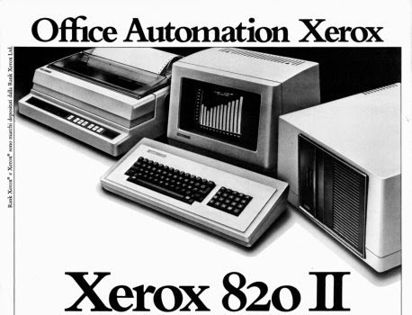

# Xerox 820 Family Media

Loose Xerox 820-family disk media — system, diagnostic, language, and
application software for the **Xerox 820** (820-I) and **Xerox 820-II**
(Z80, CP/M 2.2), received as a single archive (`xerox.7z`) and organized here
by target machine and container format.

This folder is the software companion to two siblings:

- [`../Xerox-820-16-8/`](../Xerox-820-16-8/) — the Xerox 16/8 (820-II + 8086
  coprocessor): boot media, firmware source, and the bring-up documentation.
- [`../Xerox-820-line-roms/`](../Xerox-820-line-roms/) — the 820-line ROM
  lineage (820, 820-II, 16/8).

## Layout

| Folder | Contents |
|---|---|
| [`disks/820-I/teledisk/`](disks/820-I/teledisk/) | 820-I `.td0` media: system disks (5.25" and 8", including SSSD) and diagnostics. |
| [`disks/820-II/imagedisk/`](disks/820-II/imagedisk/) | 49 Xerox 820-II / Rank Xerox `.imd` images (8"): CP/M 2.2 (Xerox 1982 and RX v2.2E), the RX Base Reference System (floppy and rigid variants), the Accounting Plus v5.10 thirteen-disk set plus AP/AR/inventory/payroll/point-of-sale modules, dBASE II, ASCOM v2.03, the 3720 v3.3 and 3780 v4.2 communications emulators, CP/M-86 diagnostics, the UK System Checker, and word-processing/utility masters. |
| [`disks/820-II/teledisk/`](disks/820-II/teledisk/) | 820-II `.td0` media: system, diagnostic, training, and word-processing disks in both 5.25" (`*5`) and 8" (`*8`) forms. |
| [`disks/other-xerox/`](disks/other-xerox/) | Xerox 860 word-processor and Xerox 1800-labeled `.td0` media from the same archive (no MAME target yet; preserved). |

The full per-directory inventory is in [`disks/README.md`](disks/README.md);
per-image media sizes (from ImageDisk track maps / TeleDisk drive-type
headers) are in [`disks/MEDIA-SIZES.md`](disks/MEDIA-SIZES.md).

## Machines in MAME

The whole 820 family was restructured and brought up in
[mamedev/mame#15485](https://github.com/mamedev/mame/pull/15485) (merged
2026-07-02) — the 820-II disk personalities became self-installing slot
devices, the SASI rigid-disk chain (Shugart SA1403D) moved onto MAME's nscsi
bus, and both keyboards (the X928 ASCII keyboard and the position-encoded
Low Profile Keyboard) became proper devices.  The widely-circulated bad
`u35` monitor dump (data bit 7 stuck high) was replaced with a clean part in
[mamedev/mame#15467](https://github.com/mamedev/mame/pull/15467).  Along the
way the family picked up the fixes that make these disks actually boot:
FDC-to-NMI gating through /HALT (the old warm-boot hang), the FM/MFM
density-select polarity (single-density track 0), and the keyboard strobe
polarity + power-on hello that make typing work.

All of these systems are in mainline MAME and marked working:

| MAME system | Machine | Media here | Status |
|---|---|---|---|
| `x820` | Xerox 820 (820-I) | `disks/820-I/teledisk/` | Boots CP/M 2.2 from 5.25" and 8" system disks; interactive. |
| `x820ii` | 820-II, 8" floppy | `disks/820-II/imagedisk/`, `*8.td0` | Boots CP/M 2.2 (Xerox and Rank Xerox RX v2.2E); runs the application set. |
| `x820ii5` | 820-II, 5.25" floppy | `disks/820-II/teledisk/*5.td0` | Boots the 5.25" system and SIS disks. |
| `x820iilp` | 820-II with the Low Profile Keyboard | as `x820ii` | For the LPK-family monitor ROMs (v016/v018). |
| `x820iis` | 820-II, SASI hard disk | as `x820ii` | Boots CP/M 2.2 over SASI; serves an SA1004-class rigid CHD. |

The 16/8 machines (`x168`, `x1685`, `x168em`, `x168s`) and their media are
covered in [`../Xerox-820-16-8/`](../Xerox-820-16-8/).  The Big Board — the
design the 820 was derived from — lives in [`../bigboard2/`](../bigboard2/).

## Software lists

Mainline MAME ships software lists for both machines —
[`hash/xerox820.xml`](https://github.com/mamedev/mame/blob/master/hash/xerox820.xml)
and
[`hash/xerox820ii.xml`](https://github.com/mamedev/mame/blob/master/hash/xerox820ii.xml)
— mountable by name (e.g. `mame x820ii cpm`).  The loose images here
complement those lists: the same machines, but a wider set (the Rank Xerox
RX releases, the Accounting Plus suite, communications emulators,
diagnostics, and the 820-I system/diagnostic disks), kept in their original
container formats.

## Verified in MAME

Boot-screen checked against the current drivers:

- `x820` — `disks/820-I/teledisk/820sys5.td0`
- `x820` — `disks/820-I/teledisk/sssd.td0`
- `x820ii5` — `disks/820-II/teledisk/8202cpm5.td0`
- `x820ii5` — `disks/820-II/teledisk/8202sis5.td0`
- `x820ii5` — `disks/820-II/teledisk/5sys-ii.td0`
- `x820ii5` — `disks/820-II/teledisk/5dsys-ii.td0`
- `x820ii` — `disks/820-II/imagedisk/Xerox 820-II CP-M v2.2 Rev 1.000 (1982)(Xerox)[Part Number 130S22203, Code 2Q82].imd`
- `x820ii` — `disks/820-II/imagedisk/RX v2.2E CP-M (19xx)(-).imd`
- `x820ii` — `disks/820-II/imagedisk/RX Base Reference System (19xx)(-)[Floppy Version].imd`
- `x820ii` — `disks/820-II/imagedisk/RX Base Reference System (19xx)(-)[Rigid Version].imd`
- `x820ii` — `disks/820-II/imagedisk/Accounting Plus v5.10 (19xx)(-)(Disk 1 of 13)(System Control Disk).imd`
- `x820ii` — `disks/820-II/imagedisk/Xerox 820-II SC.COM etc (19xx)(-)[Master].imd`
- `x820ii` — `disks/820-II/imagedisk/CP-M86 Diagnostics (19xx)(-).imd`
- `x820ii` — `disks/820-II/imagedisk/UK System Checker (19xx)(-)(GB).imd`
- `x820ii` — `disks/820-II/imagedisk/dBase II CPM v2.2 SD Master (19xx)(-).imd`

## Provenance

Received as one archive (`xerox.7z`).  TeleDisk `.td0` files are preserved
byte-for-byte as received; the `.imd` images are ImageDisk captures
identified by their headers and embedded CP/M strings.  Material is
preserved here for emulation and historical/technical reference.

---

**Work on a copy.**  MAME persists writes back to mounted floppy images on
exit and can corrupt them.  Copy or `chmod -w` any disk before mounting it.
