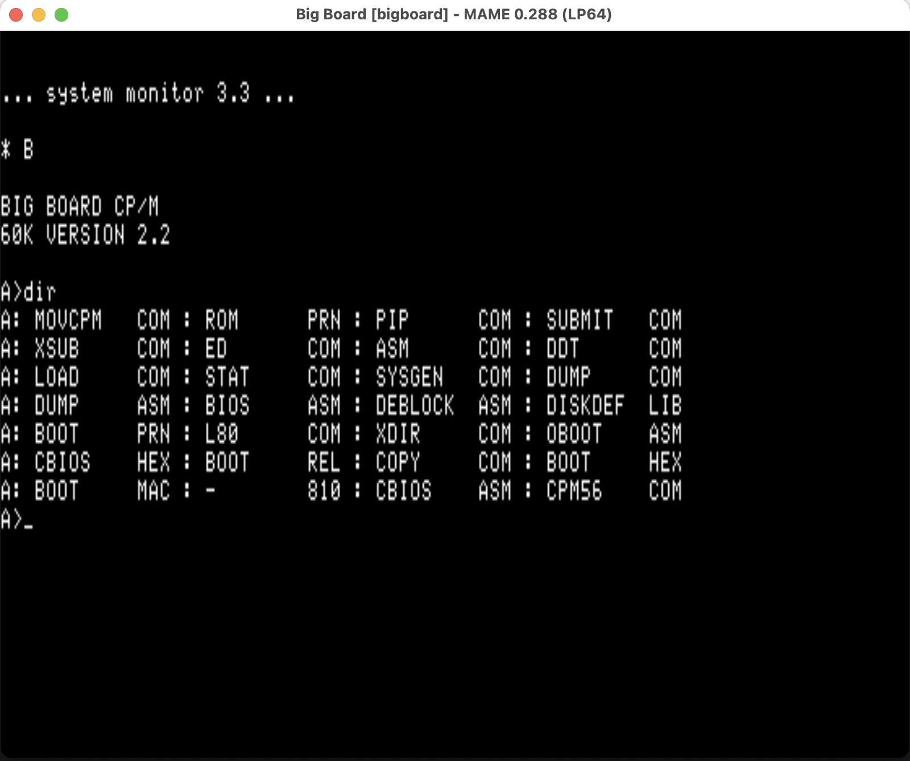

# Big Board



*The Big Board booting in MAME 0.288: ROM system monitor 3.3, the `B`oot
command, CP/M 2.2 (60K) sign-on, and a `DIR` of the BB1 system disk.*

The **Big Board** (Digital Research Computers, Texas, 1980) is the original
Ferguson Z80 CP/M single-board computer, sold as a bare-board kit: Z80 @ 2.5
MHz, 64 KB DRAM, on-board 80×24 video and keyboard interface, and a WD1771
floppy controller for two 8" Shugart SA-800 drives. The Xerox 820 is a licensed
derivative of this design, which is why the MAME driver lives with the Xerox
820 family: system `bigboard`, driver
[`xerox/xerox820.cpp`](https://github.com/mamedev/mame/blob/master/src/mame/xerox/xerox820.cpp).
(The later Big Board II is a different machine — see
[`bigboard2/`](../bigboard2/).)

## Contents

| Path | Content |
|---|---|
| [`disks/`](disks/) | Sixteen 8" boot/system/user-group disk images (IMD) |
| [`disks/CONTENTS.md`](disks/CONTENTS.md) | Full per-disk file listings + cpmtools access recipe |
| [`docs/photos/`](docs/photos/) | The MAME boot screenshot |

## The disks

All images are 8" SSSD: 77 tracks × 26 sectors × 128 bytes, FM (IBM 3740-style
layout, CP/M skew 6, 2 reserved system tracks). Every disk carries boot code on
its system tracks. Imaged from my collection of original Big Board 8" disks
(the IMD set was prepared for Gotek/FlashFloppy use on real hardware).

| Disk | Role / notable contents | SHA-1 |
|---|---|---|
| `BB1.imd` | CP/M 2.2 system disk (56K — `CPM56.COM`), MOVCPM, BOOT/CBIOS sources, LINK-80, full utility set. **Boot-verified in MAME** (the hero shot above). | `97315e4a2d9b62abf5b9fda60cebd0a9d515723b` |
| `BB2.imd` | CP/M system/development disk — `CPM60.COM`, Microsoft MACRO-80 + LINK-80 (`M80`/`L80`), CBIOS sources | `c2801fb8e2c13b89fcd529ea7137a92bc956d645` |
| `BB3.imd` | ROM monitor + BIOS source disk — `MONITOR.ASM`, `ROM.ASM/.HEX`, `BOOT`/`CBIOS` sources, `READ.ME` | `ec87ba77a9774622da920e3dd370aa5caf8e04b6` |
| `BB4.imd` | CP/M 2.2 system disk (60K) — `CPM.COM`, `CPM60.COM`, MOVCPM, SYSGEN, BOOT/CBIOS/BIOS sources | `e17c7979873cb03563d39586d6c9eb305b7f8e35` |
| `BBUD01.imd` | Big Board Users Disk #1 — MODEM7, formatters, CROWEASM | `d9e2e0e65780e44af3854016e5e0cdde8c61278b` |
| `BBUD05.imd` | Big Board Users Disk #5 — catalog tools, MODEM7A/B, CRCK | `2d79e0c35d498f9f2ad7a1789a3364132aa52bbb` |
| `BBUD07.imd` | Big Board Users Disk #7 — checkbook, memory/file tools, C sources | `6f45855c35bcd7300e3214fc0e6ffd42f1bb5068` |
| `BBUD09.imd` | Big Board Users Disk #9 — E800/EA00 BIOS builds, EPROM programmer, MODMON, Adventure | `c6cb6050a9519ef59b587d18e47b10a083e76895` |
| `BBUD13.imd` | Big Board Users Disk #13 — XMON monitor, sort utilities, C sources | `56d92ddc75d1e23926b79a8d4095107da8b66ae5` |
| `BBUD14.imd` | Big Board Users Disk #14 — SIO/baud tools, BDS C bits, games, Pascal/BASIC demos | `42bad0ff7a041bc32c58fd5b3766188fc31754bb` |
| `BBUD15.imd` | Big Board Users Disk #15 — TED editor, tinyplan spreadsheet, C sources | `b838de71f0fff09cb5d4595de3c769e6eecdd627` |
| `BBUD17.imd` | Big Board Users Disk #17 — Small-C compiler (full source) + I/O library | `a900cf9ac6947e617d411fa8ba190760475baf68` |
| `ADVENT.imd` | Adventure (`ADV.COM` + databases) on a bootable runtime disk | `bc41f69aeba4faaa7baa352def967a25c3346b4c` |
| `GAMES.imd` | Games — Ladder, PacMan, Quatris, Aliens | `2ea3f432b27fdbd73075809870b5e8a370f9fc80` |
| `PASCAL.imd` | Turbo Pascal (`TURBO.COM` + TINST) with blinkenlight demo sources | `4e34ce1ab2a397268cee1bf7959acbd899f74bd3` |
| `PORTS.imd` | Minimal utility disk — PORTER port I/O tool + stock utilities | `954debe2e41fb17e9e1aed058059f07bb44e4946` |

The `-`-named label files on the system disks (`-.810` … `-.813`) sequence the
BB1–BB4 set.

## Running it

```sh
mame bigboard -flop1 BB1.imd
```

The screen stays blank until the first keystroke — press a key and the ROM
monitor's `... system monitor 3.3 ...` banner and `*` prompt appear. Type `B`
to boot CP/M from drive A.

**Work on a copy** — MAME persists floppy writes back to the image on exit.

The driver also has a 5.25" variant (`bigboard5`); no 5.25" Big Board media
survives in this set — all sixteen disks are 8".

## Provenance & attribution

- **CP/M 2.2** is a product of Digital Research, Inc.
- **MACRO-80 / LINK-80** are products of Microsoft; **Turbo Pascal** is a
  product of Borland International.
- The **BBUD series** are Big Board user-group disks; their contents are
  user-contributed and public-domain-era utilities, preserved here as imaged.
- The disk imaging, curation, and this documentation are mine; third-party
  software on the disks is preserved under the repository
  [LICENSE](../LICENSE) §2 terms.
